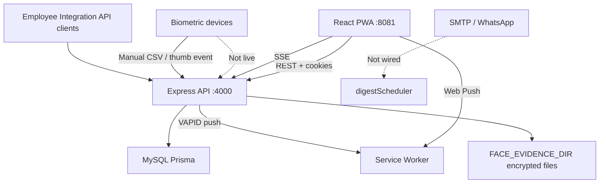

# Application Audit — Frontend, Backend, Database & Flows

**Date:** 27 July 2026 (refresh **12 Aug 2026** for store / Capacitor / push)  
**Branches:** production deploy from **`main`**  
**Method:** Code review of routes, Express APIs, Prisma models, jobs, menus, and cross-checks against `UX_FLOW_AUDIT.md`, `OPERATIONS_AND_WORKFLOWS.md`, `ATTENDANCE_LEAVE_AND_FACE_POLICY.md`, and `PLAY_LAUNCH_STATUS.md`.

This is an **issue and completeness register**, not a claim that every row is unfixed. Items marked **Fixed recently** were verified in code after late-July policy work.

---

## Executive summary

| Layer | Health | Notes |
| ----- | ------ | ----- |
| **Auth / sessions / RBAC core** | Strong | Login, refresh, module middleware, face gate, Dev Admin protections |
| **Attendance + leave policy** | Strong | Full/Half/Absent, Missed Checkout empty out, Comp Off, holidays, shifts |
| **Face verify** | Strong | Multi-angle enroll; check-in verify-only (no daily photos) |
| **People / profile ops** | Partial | Dev Admin–only edits by design; profile edit-request still 501 |
| **Expenses / certificates** | Mostly usable | Expense PAID path fixed; CEO read-only clarity still weak |
| **Biometrics** | Half | Device/mapping + CSV/thumb ingest APIs exist; **no live device connector** |
| **Deferred modules in DB** | Empty shells | Roster, OT, appraisals, SOP, vault, recruitment tables with **no app code** |
| **Notifications** | Stronger | In-app + Web Push; native FCM/APNs subscribe + HTTP v1 sender (env optional) |
| **Store / Capacitor shell** | Ready | Android AAB signed; Play upload blocked on Console verification only |

**Company-ready for:** face-gated login, mobile GPS attendance, leave, tasks, assets, holidays/branches (Dev Admin), checklists, basic expenses/certificates, HR day logs.

**Not company-ready without fixes / product decisions:** emergency contact capture, discoverable field/branch attendance, live biometric devices, payslips, email digests, self-serve profile corrections (if required), unused future tables cleanup.

---

## 1. What is fully implemented (working baseline)

| Flow | Frontend | Backend | DB | Notes |
| ---- | -------- | ------- | -- | ----- |
| Login / first password / restore | Yes | Yes | users | |
| Face enroll (C/L/R) + Dev Admin approve | Yes | Yes | face_* | Photos once; verify later without store |
| Mobile check-in (face+GPS) / check-out (GPS) | Yes | Yes | attendance_events / summaries | Offline queue on dashboard |
| Missed checkout + next-day check-in | Yes | Yes | summaries, empty punch-out | Prior open day flagged; no SYSTEM out |
| Punch corrections + HR lock window | Yes | Yes | correction_requests | |
| Leave apply / approve / cancel / medical 48h | Yes | Yes | leave_* | |
| Weekly off + Comp Off on holiday Full Day | Yes | Yes | weekly_off / comp_off | |
| Company holidays | Yes | Yes | holidays | Company-wide |
| Shift on employee edit + catalog API | Yes (Employees) | Yes | shift_* | Catalog create API exists; UI mainly assigns via employee edit |
| Work Planner boards/tasks | Yes | Yes | task_* | |
| Assets + returns + investment views | Yes | Yes | company_assets | |
| Expenses + HR documents | Yes | Yes | expense / certificate | |
| Checklists onboarding | Yes | Yes | checklist_* | Completed items locked |
| Devices + biometric mapping + thumb CSV/event | Yes | Yes | biometric_* | Manual ingest, not live sync |
| Announcements + push | Yes | Yes | announcements / push | |
| Employee Integration API | Docs/OpenAPI | Yes | integration_* | Face/biometrics excluded by design |
| Forgot-password → Dev Admin notify | Yes | Yes | audit + notifications | Not self-serve reset email |
| Theme light/dark | Yes | n/a | localStorage | No Auto mode |

---

## 2. Critical / high issues still open

| ID | Severity | Area | Finding | Evidence | Fix needed |
| -- | -------- | ---- | ------- | -------- | ---------- |
| A1 | **Done (P0)** | People | Emergency contact UI on Profile + HR/Dev Admin write API | Profile + Employees | Employee self-edit of EC deferred pending product decision |
| A2 | **Done (P0)** | Attendance nav | Field and Branch attendance in role menus | `menu.ts` | Matches backend roles |
| A3 | **Done (P0)** | Attendance | `/attendance/mismatch` route removed | deleted route file | No redirect stub |
| A4 | **Done (P0)** | People | HR manager + emergency contact dialog | `_app.employees.tsx` | PATCH still only `managerId` for HR |
| A5 | **Superseded** | Profile | `POST /profile/edit-requests` still returns **409/501** and is unused. Post-punch verification + **Profile Corrections** is the live correction path. | `profileCorrections.ts`, `_app.profile-corrections.tsx` | Leave the stub; do not build a second edit-request queue |
| A6 | **Medium→High** | Biometric | Devices/mappings UI + `/attendance/thumb/*` exist; **no live eSSL/ZK sync**. Product still says “next version”. | devices routes; docs out-of-scope | Keep deferred **or** schedule connector project |
| A7 | **Medium** | Deploy | Building with `NODE_ENV=development` breaks SSR (`jsxDEV`). Happened on 27 Jul. | Frontend 500; docs updated | Always `NODE_ENV=production npm run build` |

**Expense PAID (old C1):** Current `reviewOptions` includes `PAID` for `UNPAID` rows — treat as **fixed** unless QA finds a residual dialog bug.

**Forgot-password (old H4):** **Fixed** — email form notifies Dev Admin.

**Checklist complete lock (old H9/M6):** **Fixed** — completed/cancelled items disabled; confirm on mark complete.

---

## 3. Half-implemented features

| Feature | What exists | What’s missing |
| ------- | ----------- | -------------- |
| **Shift catalog** | API `GET/POST /shifts`, assign on employee edit, auto `ensureEmployeeShiftAssignment` on punch | Dedicated Shift admin screen; bulk assign; inactive catalog management UI |
| **Field attendance** | Page + menu for ops roles; GPS/mobile day logs | `field_attendance` table unused (legacy; punches live in `attendance_events`) |
| **Employee branch schedule** | Model + engine lookup | Little/no HR UI to manage schedules |
| **Offline punches** | IndexedDB queue + dashboard flush on online | No dedicated queue UI; face payload in offline check-in may expire/fail if session nonce reused |
| **Notification digests** | Preferences UI + `digestScheduler` | SMTP not configured — scheduler only logs counts |
| **WhatsApp digests** | Mentioned in docs | Not implemented |
| **ID card emergency contact** | API returns EC | Card UI often ignores EC fields |
| **Role shortcuts** | `src/lib/role-shortcuts.ts` | **Never imported** — dead module |
| **Leave Approvals for HR** | Menu item for HR | Empty if HR is not org head (`canApprove` false) — confusing |
| **Main Admin + Employee Requests** | Module matrix | Often no menu / module — deep-link blocked |
| **CEO Employee Requests** | Can view | No Review buttons (HR-only by design) — needs banner |
| **FIELD expense type** | Selectable | No `claimMeta` from/to fields |
| **Medical attach at apply** | Drive URL on apply; file upload on History | Split UX still awkward |
| **Thumb attendance** | CSV + event API | No scheduled device pull; operators must push events |

---

## 4. Not implemented (deferred / empty shells)

These **Prisma models exist** but have **no meaningful `prisma.*` usage** in `server/src` (except wipe/reset for some):

| Model / area | Status |
| ------------ | ------ |
| `RosterAssignment` | Schema only — no roster UI/API |
| `OvertimeClaim` | Schema only — no OT claims |
| `AppraisalCycle` / `AppraisalReview` | Schema only |
| `CompanyDocument` / `DocumentAck` | Document vault **deferred** |
| `SopArticle` / `SopRead` | SOP library **deferred** |
| `RecruitmentJob` / `Candidate` | ATS **deferred** |
| `ProfileEditRequest` | Table exists; unused stub API. Live path is `ProfileCorrectionRequest` + post-punch verification |
| Payslips / payroll deductions | Explicitly out of scope |
| Live biometric device connectors | Explicitly out of scope |
| Email SMTP delivery | Not wired (no nodemailer) |

**Recommendation:** Either build the next slice (OT/roster) or add a migration later to drop unused tables to reduce schema noise — after product confirmation.

---

## 5. Stub / redirect routes (incomplete UX)

| Route | Behaviour | Risk |
| ----- | ---------- | ---- |
| `/emergency-contact` | → `/profile#emergency-contact` | OK — Profile owns the UI |
| `/attendance/mismatch` | **Removed** | No stub remains |
| `/leave/balance` | → `/leave/history` | Medium — balances live on Apply/Policy |
| `/roles` | → `/dashboard` | Low |
| `/company-setup` | → `/branches` | Low |
| `/users/new` | → `/users?create=true` | OK |

---

## 6. Backend / API notes

| Topic | Finding |
| ----- | ------- |
| **RBAC** | Backend authoritative via `requireAuth` + module access; generally solid |
| **Face** | Enrollment requires 3 views; attendance omits `imageData`; evidence multi-row per session |
| **Attendance jobs** | Settlement + missed checkout + medical reminders on interval — OK |
| **Deprecated** | `settleExpiredOpenPunches` wraps missed-checkout; safe |
| **Leave type CRUD** | POST/PATCH/DELETE blocked (“company policies protected”) — Policy page is credit adjust, not type CRUD |
| **Employee API** | Separate credentialed API; excludes face/secrets — OK |
| **Reset test data** | Dev Admin path clears many tables including unused ones |

---

## 7. Database / integrity notes

| Topic | Finding |
| ----- | ------- |
| **Hot path indexes** | Attendance, leave, face generally indexed |
| **Face multi-view migration** | Applied; unique session_id dropped with FK recreate |
| **Unused tables** | See §4 — integrity risk is low (empty) but confusing for DBAs |
| **`field_attendance`** | Legacy table; live GPS punches use `attendance_events` + summaries |
| **`hasMissingOutEvent`** | Still true for Missed Checkout without real out — **no longer blocks** next-day check-in |
| **Encryption** | Employee private fields + face evidence use shared key — key loss = unreadable |

---

## 8. Frontend / flow gaps (by persona)

### Employee / field staff
- Punch, leave, tasks, expenses, certificates, profile (read), ID card, notifications — **OK**
- Cannot maintain emergency contact or most profile fields
- Missed punch not always obvious from Mine header (Apply Leave CTA dominates)

### Manager / org head
- Leave approvals — **OK**
- No Leave Tracking menu; Field/Branch attendance hard to find
- Corrections if reporting manager flag set

### HR
- Tracking, corrections, assets, checklists, holidays (if permitted), employee requests review — **OK**
- No employee Edit UI; Departments/User Logins Dev Admin only
- Leave Approvals menu often empty

### CEO
- Read-heavy dashboards — **OK**
- Cannot review expenses/docs; cannot post announcements (by design unless changed)

### Developer Admin
- Full provisioning, face security, modules, devices — **OK**
- Owns password resets from forgot-password notifications

---

## 9. Connections map (what talks to what)

---

## 10. Recommended fix priority

### P0 — Trust / discoverability (1–2 days)
1. Emergency contact UI + write API  
2. Menu links for Field / Branch attendance (or remove pages)  
3. Remove or rename `/attendance/mismatch` and `/emergency-contact` stubs  
4. HR reporting-manager edit **or** freeze product rule in USER_GUIDE  

### P1 — Role clarity (2–3 days)
5. Leave Approvals menu only for roles that can approve; HR → Tracking  
6. CEO/Main Admin Employee Requests banners / module access decision  
7. Wire or delete `role-shortcuts.ts`  
8. FIELD expense meta fields  

### P2 — Hardening (ongoing)
9. Offline punch: re-create face session on sync (don’t reuse expired nonce)  
10. Medical file upload also on Apply  
11. Shift catalog admin screen  
12. Drop or quarantine unused Prisma models after product sign-off  

### P3 — Explicit future projects
13. Live biometric connector  
14. Payslips / payroll  
15. SMTP email digests → then WhatsApp  

---

## 11. Suggested QA smoke (production)

1. Login → face gate (if enabled) → dashboard loads (HTTP 200, no “page didn’t load”)  
2. Check-in with face (no new photo in Face Security evidence for that punch)  
3. Skip checkout → next day check-in still works; prior day shows Missed Checkout  
4. Leave apply + approval + Comp Off holiday Full Day  
5. Expense PENDING → UNPAID → PAID  
6. Forgot password → Dev Admin notification  
7. Hard refresh after deploy with `NODE_ENV=production` build only  

---

## 12. August 2026 store / platform refresh

| Area | Status | Evidence |
| ---- | ------ | -------- |
| Public legal + deletion | Done | `/privacy`, `/terms`, `/account-deletion` |
| Digital Asset Links | Done | `public/.well-known/assetlinks.json` |
| Native push channel column | Done | Migration + `push_subscriptions.channel` |
| FCM HTTP v1 | Code done; prod env optional | `server/src/push.ts`, `.env.example` |
| Android targetSdk 36 | Done | `android/variables.gradle` |
| Portrait lock fold/tablet safe | Done | Manifest unlocked; `screen-orientation.ts` |
| Play AAB | Built on laptop | See `PLAY_LAUNCH_STATUS.md` |

## 13. August 2026 security hardening

See [SECURITY_HARDENING_2026-08-12.md](SECURITY_HARDENING_2026-08-12.md). Highlights:

| Area | Status |
| ---- | ------ |
| Support password TTL + audit/notify on use (forced reset removed 15 Aug 2026) | Done |
| Refuse default JWT/encryption secrets (unless `ALLOW_INSECURE_DEV_SECRETS`) | Done |
| Web Push endpoint allowlist (SSRF) | Done |
| Signed ID-card verification tokens | Done |
| `private_files` ownership + MIME magic bytes | Done |
| Refresh/login session rotation; DA lockout; login enumeration hardening | Done |

**Not Play blockers:** A5 profile edit-request 501, A6 live biometric connector, email digests.

## Document ownership

| Item | Value |
| ---- | ----- |
| File | `docs/APPLICATION_AUDIT.md` |
| Update when | After each fix batch; mark IDs Done |
| Related | `UX_FLOW_AUDIT.md`, `WORKFLOW_AND_SECURITY_AUDIT.md`, `ATTENDANCE_LEAVE_AND_FACE_POLICY.md`, `PLAY_LAUNCH_STATUS.md`, `SECURITY_HARDENING_2026-08-12.md` |
