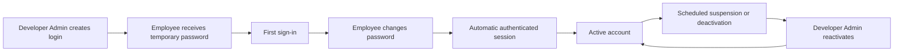
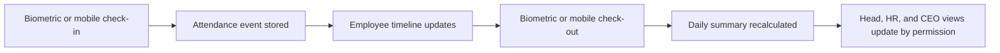
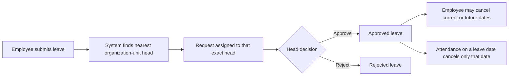

# Anytime Diesel Employee Management System: Operations And Workflows

This manual describes the behavior implemented in the current version. Permissions are enforced by the backend, not only by hidden buttons.

## Roles And Responsibility

| User              | Main responsibility                                                                                                  |
| ----------------- | -------------------------------------------------------------------------------------------------------------------- |
| Developer Admin   | Creates and manages logins, organization setup, branches, holidays, assets, devices, audit logs, and system controls |
| CEO               | Views organization-wide people, attendance, leave progress, and reports                                              |
| HR                | Maintains employee operations, leave types, holidays, branches, assets, and authorized reports                       |
| Organization head | Views the employees below their unit and acts only on leave assigned directly to them                                |
| Employee          | Uses their own profile, attendance, leave, tasks, notifications, and ID card                                         |

Developer Admin is a protected system account. It cannot be suspended, deactivated, deleted, or locked by failed passwords.

## Account Lifecycle

- Public signup is disabled.
- Five consecutive wrong passwords block a normal login.
- The login page shows the remaining attempts after each failure.
- A correct password cannot bypass a blocked status.
- Only Developer Admin can reactivate a blocked login; reactivation resets the failed-attempt counter.
- Blocking or suspending login retains the employee, attendance, biometric mapping, leave, asset, and task data.
- Biometric imports and task assignment use the employee record and continue to work while only the login is blocked.

## Organization And Employee Visibility

- Every employee belongs to an organization unit when configured.
- Unit heads are assigned on the organization chart.
- A head sees employees in their unit hierarchy; ordinary employees see only their own operational data.
- CEO and authorized operational roles can view broader summaries and reports.
- Organization placement drives team visibility and leave routing. A separate reporting-manager selection is not required for these flows.

## Attendance Flow

An attendance day can combine sources. For example, biometric check-in followed by mobile check-out is one daily timeline, as is mobile check-in followed by biometric check-out.

### Mobile branch attendance

1. The device requests browser location permission.
2. The frontend sends latitude and longitude over HTTPS.
3. The backend calculates the nearest active branch with configured coordinates.
4. When the device is within a branch's radius, the event is matched to that branch and displayed as `Mobile - Branch Name`.
5. Outside every branch radius, attendance is still accepted as `Mobile` without a branch match.
6. The submitted coordinates are stored on the attendance event in both cases.

Madhapur is configured at `17.4391592, 78.3947783` with a default 250 meter radius. Each additional branch must be given latitude, longitude, and radius in Branches before it accepts mobile branch attendance. Client visits remain a separate field workflow and are not restricted to an office radius.

### End-of-day status

- A punch always takes priority over holiday, weekly off, or approved leave status for that day.
- A no-punch day is settled only after the day ends.
- Weekly off follows each employee's configured weekdays.
- Every active entry in the portal Holiday list counts as a holiday. `Public`, `Optional`, and `Restricted` are classification labels only in this version.
- A global holiday applies to everyone; a branch holiday applies only to employees whose home branch matches it.
- Editing, moving, or deactivating a holiday recalculates existing attendance summaries for the affected date and branch.

## Leave Flow

- Only the exact head stored as the request approver can approve or reject it.
- A super-head can monitor authorized reports but cannot action a request assigned to a lower head.
- The request history displays the actual assigned approver.
- Employees can cancel their own pending request without approval.
- Employees can cancel current or future dates from approved leave; history retains the approval and cancellation record.
- Mobile check-in warns before cancelling approved leave for that date. A biometric punch cancels that date directly.
- Multi-day leave cancellation affects only the day on which attendance is given.
- Leave balances and paid/unpaid policy automation are reserved for a future version.

## Holiday Management

Developer Admin, Main Admin, and HR can add, edit, and deactivate holidays.

Required behavior:

- Name, date, classification, and optional branch scope are stored.
- Duplicate active entries for the same date and branch are rejected.
- Every active holiday-list entry is counted as a holiday for attendance.
- Deactivation preserves audit history and removes its attendance effect during recalculation.

## Task Management

- Authorized heads assign a task to one or multiple employees within permitted organization visibility.
- Every assignee sees the task and the complete assignee list.
- Employees update progress, status, work notes, and minutes worked.
- Task history keeps each update with author and time.
- Account blocking does not remove assignments or task history.

## Asset Management

- HR and Developer Admin can access Asset Management.
- Physical assets can store asset ID, serial number, value, purchase date, branch, status, and assignee.
- Online assets use their own catalog names and recurring monthly/yearly or one-time cost model.
- Investment summaries calculate physical count, online count, one-time investment, monthly recurring cost, annual recurring cost, and first-year investment by employee.
- Employees do not receive company-wide asset visibility.

## Notifications

- Notifications are filtered by the authenticated user on the backend.
- Users receive only relevant requests, assignments, leave results, holidays, birthdays, and account notices.
- Browser notification permission is optional; in-app notifications remain available.
- HTTPS is required for reliable installed-app notifications and location access.

## Audit And Data Retention

- Security and operational changes write audit records with actor, action, affected object, time, and protected values.
- Passwords, tokens, hashes, and secrets are never written as readable audit values.
- Suspension, deactivation, or login blocking does not remove historical employee records.

## Operational Verification Checklist

After every deployment verify login, first-password change, blocked-account recovery, mobile attendance, mixed-source check-out, leave submission, exact-head approval, leave cancellation, holiday recalculation, task assignment, asset access, notifications, and organization visibility with separate test users.
