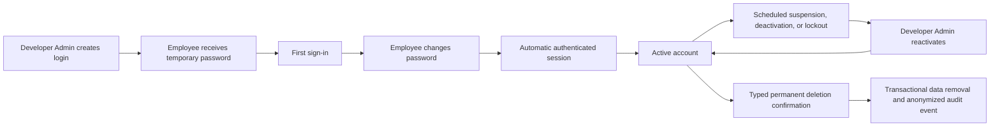
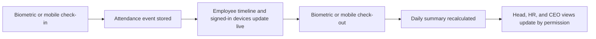
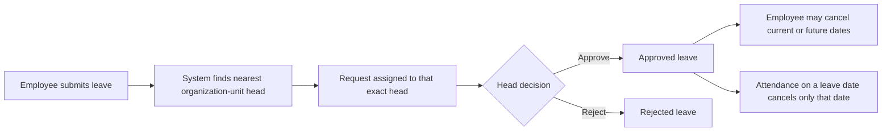
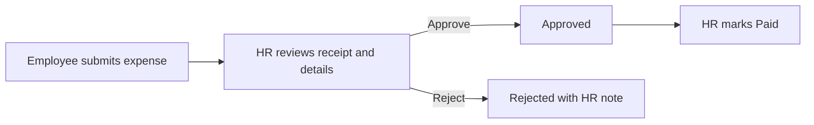

# Anytime Diesel Employee Management System: Operations And Workflows

This manual describes the behavior implemented in the current version. Permissions are enforced by the backend, not only by hidden buttons.

## Roles And Responsibility

| User              | Main responsibility                                                                                                  |
| ----------------- | -------------------------------------------------------------------------------------------------------------------- |
| Developer Admin   | Creates and manages logins, organization setup, branches, holidays, assets, devices, audit logs, and system controls |
| CEO               | Views organization-wide people, attendance, leave progress, and reports                                              |
| HR                | Maintains employee operations, leave types, holidays, branches, assets, and authorized reports                       |
| Organization head | Views the employees below their unit and acts only on leave assigned directly to them                                |
| Employee          | Uses their own profile, attendance, leave, tasks, notifications, and ID card                                         |

Developer Admin is a protected system account. It cannot be suspended, deactivated, deleted, or locked by failed passwords.

## Account Lifecycle

- Public signup is disabled.
- Five consecutive wrong passwords block a normal login.
- The login page shows the remaining attempts after each failure.
- A correct password cannot bypass a blocked status.
- Only Developer Admin can reactivate a blocked login; reactivation resets the failed-attempt counter.
- Blocking or suspending login retains the employee, attendance, biometric mapping, leave, asset, and task data.
- Biometric imports and task assignment use the employee record and continue to work while only the login is blocked.
- User Logins and Employees display active, scheduled suspension, suspended, blocked, and inactive states from the same backend account status.
- Developer Admin is the only role allowed to permanently delete an account. The current account and all Developer Admin accounts are protected.
- Permanent deletion requires typing `DELETE` and removes the login, employee profile, attendance, leave, biometric mappings, assigned assets, and employee task data in one transaction. An anonymized audit event remains.

## Organization And Employee Visibility

- Every employee belongs to an organization unit when configured.
- Unit heads are assigned on the organization chart.
- A head sees employees in their unit hierarchy; ordinary employees see only their own operational data.
- CEO and authorized operational roles can view broader summaries and reports.
- Organization placement drives team visibility and leave routing. A separate reporting-manager selection is not required for these flows.

## Attendance Flow

An attendance day can combine sources. For example, biometric check-in followed by mobile check-out is one daily timeline, as is mobile check-in followed by biometric check-out.

### Mobile branch attendance

1. The device requests browser location permission.
2. The frontend sends latitude and longitude over HTTPS.
3. The backend calculates the nearest active branch with configured coordinates.
4. When the device is within a branch's radius, the event is matched to that branch and displayed as `Mobile - Branch Name`.
5. Outside every branch radius, attendance is still accepted as `Mobile` without a branch match.
6. The submitted coordinates are stored on the attendance event in both cases.

Madhapur is configured at `17.4391592, 78.3947783` with a default 250 meter radius. Each additional branch must be given latitude, longitude, and radius in Branches before it accepts mobile branch attendance. Client visits remain a separate field workflow and are not restricted to an office radius.

### 10 AM attendance settlement

- A punch always takes priority over holiday, weekly off, or approved leave status for that day.
- At 10:00 AM IST, every active no-punch employee is settled as Absent, approved Leave, approved Weekly Off, or Holiday.
- A later mobile or biometric punch recalculates the same day immediately and changes it to the correct Present status.
- Weekly off is requested for a specific date at least one day earlier and approved only by the employee's direct organization head.
- Every active entry in the portal Holiday list counts as a holiday. `Public`, `Optional`, and `Restricted` are classification labels only in this version.
- A global holiday applies to everyone; a branch holiday applies only to employees whose home branch matches it.
- Editing, moving, or deactivating a holiday recalculates existing attendance summaries for the affected date and branch.

## Leave Flow

- Only the exact head stored as the request approver can approve or reject it.
- A super-head can monitor authorized reports but cannot action a request assigned to a lower head.
- The request history displays the actual assigned approver.
- Employees can cancel their own pending request without approval.
- Employees can cancel current or future dates from approved leave; history retains the approval and cancellation record.
- Mobile check-in warns before cancelling approved leave for that date. A biometric punch cancels that date directly.
- Multi-day leave cancellation affects only the day on which attendance is given.

### Company leave policies

- **Casual Leave:** one credit is added on the first of each month, beginning with the month after joining. A July 16 joiner receives the first credit on August 1. Twelve credits accrue per year, unused credits carry forward, and approved usage may make the balance negative. Payroll handling remains manual for HR.
- **Sick Leave:** six credits are available per calendar year and expire at year end. At most two Sick Leave days may be used in one month, and usage cannot exceed the available balance. A Google Drive medical-report link shared with anyone who has the link is due within three calendar days after the leave ends.
- **Unpaid Leave / LOP:** has no credit balance. The direct head approves the request and HR handles salary deductions manually.
- **Comp Off:** one credit is earned automatically after a completed punch-in/out work session on an active portal holiday. One credit is used per request and no approval is required. A credit expires on December 31 of the year it was earned and never carries into the next year.
- The employee and direct head see available credit, requested days, and projected balance. HR can make audited manual credit adjustments.

### Weekly-off policy

- Weekly off is not fixed during account creation or employee editing. The approved date request is the only source of truth.
- An employee chooses one date in a Monday-Sunday week and submits it at least one calendar day in advance.
- The exact direct organization head approves or rejects the request.
- Only one weekly off may be used in a week. Unused entitlement expires and never carries forward.
- Weekly offs cannot be on consecutive dates, including Sunday followed by Monday in the next week.
- A punch on an approved weekly off changes attendance to Present automatically.

## Holiday Management

Developer Admin, Main Admin, and HR can add, edit, and deactivate holidays.

Required behavior:

- Name, date, classification, and optional branch scope are stored.
- Duplicate active entries for the same date and branch are rejected.
- Every active holiday-list entry is counted as a holiday for attendance.
- Deactivation preserves audit history and removes its attendance effect during recalculation.

## Task Management

- Authorized heads assign a task to one or multiple employees within permitted organization visibility.
- Every assignee sees the task and the complete assignee list.
- Employees update progress, status, work notes, and minutes worked.
- Task history keeps each update with author and time.
- Account blocking does not remove assignments or task history.

## Asset Management

- HR and Developer Admin can access Asset Management.
- Physical assets can store asset ID, serial number, value, purchase date, branch, status, and assignee.
- Online assets use their own catalog names and recurring monthly/yearly or one-time cost model.
- Investment summaries calculate physical count, online count, one-time investment, monthly recurring cost, annual recurring cost, and first-year investment by employee.
- Employees do not receive company-wide asset visibility.
- HR completes a return checklist before an assigned asset becomes available again. The checklist records condition, accessories, charger, backup/wipe confirmation, damage, notes, receiver, and time.
- A non-working returned asset moves to `UNDER_REPAIR`; other completed returns move to `AVAILABLE`.
- Return history is retained separately from the current asset assignment and written to the audit log.

## Employee Services

### Expense claims

- Employees submit category, amount, expense date, description, and an optional HTTPS receipt link.
- An employee can list only their own claims. HR and Developer Admin can list all claims.
- Allowed transitions are Pending to Approved or Rejected, followed by Approved to Paid.
- Marking a claim Paid records the payment time. Salary or accounting-system transfer is not performed automatically.
- Submission and every HR decision are audited.

### Certificate requests

- Employees request Employment, Experience, Salary, Address Proof, Relieving, or Other certificates.
- The request records its purpose, digital/printed delivery, and optional required-by date.
- HR moves a request through Pending, In Progress, Ready, Rejected, and Collected.
- A digital document link can be attached when ready. Printed certificates can be marked ready without a link.
- Employees see only their own request status and HR notes. HR and Developer Admin see the complete queue.

## Notifications

- Notifications are filtered by the authenticated user on the backend.
- Users receive only relevant requests, assignments, leave results, holidays, birthdays, and account notices.
- Browser notification permission is optional; in-app notifications remain available.
- HTTPS is required for reliable installed-app notifications and location access.

## Announcements

- HR and Developer Admin can publish a title, message, priority, and display-until time.
- Active announcements appear for all employees until expiry.
- Open app sessions refresh immediately through an authenticated live stream.
- Installed/background applications receive Web Push when permission and VAPID configuration are available.
- Deactivation hides an announcement while retaining it for reactivation.
- Permanent deletion requires typing `DELETE`, removes the announcement from future feeds, and retains an audit event.

## Audit And Data Retention

- Security and operational changes write audit records with actor, action, affected object, time, and protected values.
- Passwords, tokens, hashes, and secrets are never written as readable audit values.
- Suspension, deactivation, or login blocking does not remove historical employee records.
- Permanent deletion is intentionally destructive and must be used only after confirming retention and legal requirements.

## Operational Verification Checklist

After every deployment verify login, first-password change, blocked-account recovery, mobile attendance, slow-network punch state, mixed-source check-out, leave submission, exact-head approval, leave cancellation, holiday recalculation, task assignment, asset return checklist, expense approval/payment, certificate readiness, notifications, and organization visibility with separate test users.
