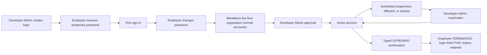
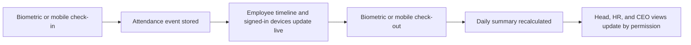
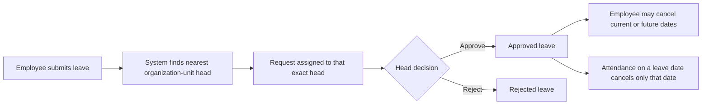
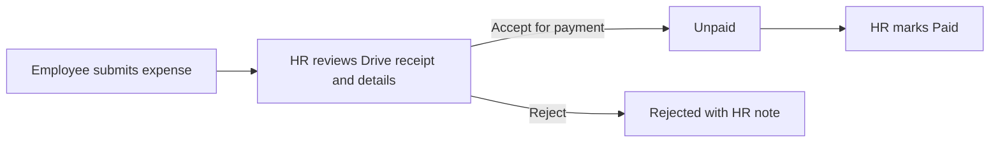

# Anytime Workforce: Operations And Workflows

This manual describes the behavior implemented in the current version. Permissions are enforced by the backend, not only by hidden buttons.

## Roles And Responsibility

| User              | Main responsibility                                                                                                  |
| ----------------- | -------------------------------------------------------------------------------------------------------------------- |
| Developer Admin   | Creates and manages logins, organization setup, branches, holidays, assets, devices, audit logs, and system controls |
| CEO               | Reviews workforce, attendance, leave progress, work delivery, and employee investment                                |
| HR                | Maintains employee operations, leave types, holidays, branches, assets, and authorized reports                       |
| Organization head | Views the employees below their unit and acts only on leave assigned directly to them                                |
| Employee          | Uses their own profile, attendance, leave, tasks, notifications, and ID card                                         |

Developer Admin is a protected system account. It cannot be suspended, deactivated, deleted, or locked by failed passwords.

Developer Admin also owns external Employee API credentials under **System Settings > Employee API
Access**. Each application receives a separate, least-privilege, expiring credential. The full key is
shown once; revocation is immediate. See the dedicated data and integration guide for operating and
recovery procedures.

Employee legal employer is stored separately from the attendance location. Available entities are
Anytime Diesel, Fuelistic Innovations Private Limited, and Royal Petro Park Private Limited; the
first two are presented under the Royal Petro Park Private Limited group. Payroll/statutory
identifiers are encrypted and are never included in Employee API v1.

## Role-Aware Workspace

The sidebar and dashboard expose only the areas relevant to the signed-in role. Hiding an action is
for usability; the backend remains the authority for every permission.

The CEO workspace is decision-focused and read-only for operational data:

1. **Workforce** provides organization-wide employee visibility.
2. **Attendance Overview** provides daily status, branch, source, punch, and movement detail.
3. **Work Planner** summarizes task ownership, due dates, delivery, and activity.
4. **Leave Overview** shows pending decisions and request progress.
5. **Company Investment** shows physical and online assets assigned to employees, including
   recurring and first-year values.

Company configuration, login administration, attendance marking, and employee self-service are not
part of the CEO workspace. HR, heads, employees, and Developer Admin retain their existing scoped
workspaces.

## Account Lifecycle

- Public signup is disabled.
- Frontend and backend access remain blocked until face registration is approved for normal
  accounts. Developer Admin is exempt and remains the review and recovery authority.
- Five consecutive wrong passwords block a normal login.
- The login page shows the remaining attempts after each failure.
- A correct password cannot bypass a blocked status.
- Only Developer Admin can reactivate a blocked login; reactivation resets the failed-attempt counter.
- Blocking or suspending login retains the employee, attendance, biometric mapping, leave, asset, and task data.
- Biometric imports and task assignment use the employee record and continue to work while only the login is blocked.
- User Logins and Employees display active, scheduled suspension, suspended, blocked, inactive, and left-company (terminated) states from the same backend account status.
- Developer Admin can offboard an employee by typing `OFFBOARD` (or `DEACTIVATE`). The current account and all Developer Admin accounts are protected.
- Offboard sets employee **TERMINATED** and login **INACTIVE** together and retains the profile, attendance, leave, biometric mappings, assigned assets, expenses, tasks, and audit history.
- Developer Admin **Bulk add** uses an in-app pasteable grid (Excel/Sheets paste supported) for create-many logins with the same validation and encryption as single create.
- Developer Admin **Bulk edit** loads existing logins into a grid; only changed rows are saved; blank password/sensitive IDs keep current values; Developer Admin accounts are excluded.
- Server-generated employee codes include time and randomness instead of a shared sequential
  counter, avoiding duplicate selection when imports or backend instances run concurrently.

## Organization And Employee Visibility

- Every employee belongs to an organization unit when configured.
- Unit heads are assigned on the organization chart.
- A head sees employees in their unit hierarchy; ordinary employees see only their own operational data.
- CEO and authorized operational roles can view broader summaries and reports.
- Organization placement drives team visibility and leave routing. A separate reporting-manager selection is not required for these flows.
- Reporting-manager changes reject direct and indirect cycles. An employee cannot report to
  themselves or create a loop through another manager.

## Attendance Flow

An attendance day can combine sources. For example, biometric check-in followed by mobile check-out is one daily timeline, as is mobile check-in followed by biometric check-out.

Day Logs use a two-level drill-down for a selected employee and a three-level drill-down for the
company view:

- Single employee: date -> complete punch timeline.
- All employees: date -> employee -> complete punch timeline.

The All Employees query returns the complete selected date range instead of stopping at the
standard list-page limit. The Excel overview reports average working time per day as total worked
seconds divided by Days Present for each employee in the exported filter range. Daily employee
worksheets continue to report the exact duration for each date. Present days require a Present
status or recorded worked seconds; Holiday, Week Off, and Pending Attendance alone do not increase
the denominator.

### Mobile branch attendance

1. Check-in requests the front camera and fresh precise-location permission.
2. The backend issues a purpose-bound, two-minute, single-use randomized head-turn challenge.
3. The browser averages three stable descriptors and supports clear spectacles; glare, masks, and
   dark/tinted glasses must not cover the face.
4. The backend matches the descriptor against the approved encrypted template and rejects
   inaccurate GPS, a different face, or an invalid/reused session.
5. A different face shows **Another face detected**, creates a visible Developer Admin security
   alert, and never creates attendance.
6. Check-out does not open the camera. It requires the authenticated employee's active check-in and
   a new precise-location reading.
7. Only then does the backend calculate the nearest active branch and create the attendance event.
8. When the device is within a branch's radius, the event is displayed as
   `Mobile - Branch Name`; an outside punch remains `Mobile` and retains coordinates.
9. Encrypted evidence expires after five days by default and is also capped at the latest five
   pictures per person. Developer Admin can choose 1–30 days and review retained evidence under
   **Face Security**.

Failed face, liveness, anti-spoof, session, or location verification never creates attendance. See
[Face Registration and Verified Attendance](FACE_ATTENDANCE_SECURITY.md) for the complete
enrollment, approval, retention, and recovery contract.

Madhapur is configured at `17.4391592, 78.3947783` with a default 250 meter radius. Each additional branch must be given latitude, longitude, and radius in Branches before it accepts mobile branch attendance. Client visits remain a separate field workflow and are not restricted to an office radius.

### 10 AM attendance settlement

- CEO and Developer Admin accounts do not require attendance and are excluded from automatic absence settlement and attendance totals.
- A punch always takes priority over holiday, weekly off, or approved leave status for that day.
- At 10:00 AM IST, every active no-punch employee is settled as Absent, approved Leave, approved Weekly Off, or Holiday.
- A later mobile or biometric punch recalculates the same day immediately and changes it to the correct Present status.
- Weekly off is requested for a specific date at least one day earlier and approved by the employee's organization head or a higher head in that chain.
- Every active entry in the portal Holiday list counts as a holiday. `Public`, `Optional`, and `Restricted` are classification labels only in this version.
- A global holiday applies to everyone; a branch holiday applies only to employees whose home branch matches it.
- Editing, moving, or deactivating a holiday recalculates existing attendance summaries for the affected date and branch.

## Leave Flow

- Only the exact head stored as the request approver can approve or reject it.
- A super-head can monitor authorized reports but cannot action a request assigned to a lower head.
- The request history displays the actual assigned approver.
- Employees can cancel their own pending request without approval.
- Employees can cancel current or future dates from approved leave; history retains the approval and cancellation record.
- Mobile check-in warns before cancelling approved leave for that date. A biometric punch cancels that date directly.
- Multi-day leave cancellation affects only the day on which attendance is given.

### Company leave policies

- **Casual Leave:** join on or before the 5th → first credit at that month-end; join after the 5th → first credit at the next month-end. Then one credit each month-end. Twelve credits accrue per year; unused credits carry forward. Approvals that would leave an invalid negative balance are blocked. Payroll handling remains manual for HR.
- **Sick Leave:** six credits are available per calendar year and expire at year end. At most two Sick Leave days may be used in one month, and usage cannot exceed the available balance. A private medical certificate upload (PDF/image; no public Drive links) is due within 48 hours after return-to-work; reminders are sent at 24 hours and 2 hours before the deadline.
- **Unpaid Leave / LOP:** has no credit balance. The direct head approves the request and HR handles salary deductions manually.
- **Comp Off:** one credit is earned after a completed Full Day (≥9 hours) work session on an active company holiday. Reporting Head approval is required; balance is consumed only on approval. A credit expires on December 31 of the year it was earned and never carries into the next year.
- Leave balance changes are recorded in an explicit ledger (accrual, usage, carry-forward, expiry, revoke).
- The employee and Reporting Head see available credit, requested days, and projected balance. HR can make audited manual credit adjustments.

### Weekly-off policy

- Weekly off is not fixed during account creation or employee editing. The approved date request is the only source of truth.
- Non-Sunday weekly offs must be requested at least one calendar day in advance and go to the organization head for approval.
- Sunday weekly offs auto-confirm for today or a future Sunday (past Sundays are blocked).
- Only one weekly off may be used in a Monday–Sunday week. Unused entitlement expires and never carries forward.
- Weekly offs cannot be on consecutive dates, including Sunday followed by Monday in the next week.
- Weekly offs cannot fall on a company holiday; choose another day in the same week.
- A punch on an approved weekly off recalculates attendance from the worked hours (Full Day / Half Day / Absent).

## Holiday Management

Developer Admin, Main Admin, and HR can add, edit, and deactivate holidays.

Required behavior:

- Name, date, classification, and optional description are stored. Holidays are company-wide (not branch-scoped).
- Duplicate active entries for the same date and name are rejected.
- Every active holiday-list entry is counted as a holiday for attendance.
- Deactivation preserves audit history and removes its attendance effect during recalculation.

## Attendance results

- Primary day results are **Full Day** (≥9h), **Half Day** (4–&lt;9h), and **Absent** (&lt;4h).
- **Late** and **Missed Checkout** are flags, not primary results. During the slot punch-out is
  empty; after shift end with no punch-out the day shows **Punch-out required** / Missed Checkout.
  Employees submit a missed punch for org-head / HR approval within two days, then HR lock.
- **Missed Checkout never blocks the next day’s check-in.** If a prior day is still open when the
  employee checks in again, that prior day is marked Missed Checkout (empty punch-out) and today’s
  punch is accepted. Corrections remain optional within the two-day window.
- Mobile location sources are labeled **`{Branch name} · Mobile`** (inside branch radius) or
  **Mobile** (outside). Biometric punches use **`{Branch name} · Biometric`**.
- Employees must have an assigned shift for the attendance date (catalog assignment; profile times
  are used to backfill).
- Face registration stores centre/left/right photos once; daily check-in verifies live and does not
  store new photos. See [Attendance, Leave, and Face Policy](ATTENDANCE_LEAVE_AND_FACE_POLICY.md).

## Work Planner

- The screen is named **Work Planner**. Its landing page lists **Your work**, accessible active
  projects, and recoverable archived projects.
- Each project has a unique `keyPrefix` and allocates sequential `issueKey` values (`OPS-12`) with
  an atomic `nextIssueNumber` counter. Issue types are Task, Bug, Story, and Epic. Board columns
  order issues by stored `rank` (drag-and-drop persists neighbors via rank before/after).
- Projects support open, role-gated, and member-gated access. The backend applies board visibility to
  both project and issue queries; frontend filtering is not treated as authorization.
- Each project provides Board (Kanban), Backlog, and Timeline projections of the same stored issues.
  Dragging, inline stage selection, and detail-sheet stage changes call the same versioned task
  update API. Cross-project moves re-key the issue and require a valid target stage; assignees must
  remain eligible on the target project.
- Developer Admin, Main Admin, CEO, and HR can assign any active employee and may mutate issues on
  boards they can view through task scope. Organization heads can assign within their permitted team.
- Every issue has one or more active assignees. Every assignee sees the complete assignee list.
- A project defines ordered, colored stages. Each stage has an explicit canonical status; moving an
  issue to a stage updates both values together.
- Project configuration is versioned. Only its creator or Developer Admin may edit, archive, or
  restore it. Renaming `keyPrefix` rewrites issue keys when the planned keys are free. Stale writes
  receive HTTP 409.
- Archived projects are read-only through the API until restored; new issues, issue changes,
  activity, and configuration changes are rejected.
- Populated stages cannot be removed. When an existing stage's canonical status changes, its issues
  receive a version increment and typed activity in the same transaction. A project cannot be changed
  to role/member gating unless every current assignee remains eligible.
- Employees may update status, progress, stage, column rank, and work notes on their assigned work.
  Broader edits and reassignment require task-management permission.
- Issue edits use a version number. If two sessions edit the same issue, the stale session receives a
  conflict and must refresh instead of overwriting newer data.
- Issue details, assignment replacement, version increment, and typed activity history are committed
  in one transaction. Rank allocation for stage moves runs inside that transaction.
- Account blocking or employee deactivation does not delete assignments or issue history.
- Migration `20260722213000_task_workspace_v2` removes only legacy Task/board records as an explicit
  redesign reset. Migration `20260729120000_jira_work_planner_keys` adds project keys, issue keys,
  issue types, and ranks (backfilling existing board issues).

## Asset Management

- HR and Developer Admin can access Asset Management.
- Physical assets can store asset ID, serial number, value, purchase date, branch, status, and assignee.
- Online assets use their own catalog names and recurring monthly/yearly or one-time cost model.
- **Company investment per employee** shows how much Anytime Diesel invests in each employee through currently assigned physical assets and online services. It calculates physical count, online count, one-time investment, normalized monthly recurring cost, annual recurring cost, and first-year investment. First-year investment equals one-time investment plus annual recurring cost.
- Employees do not receive company-wide asset visibility.
- HR completes a return checklist before an assigned asset becomes available again. The checklist records condition, accessories, charger, backup/wipe confirmation, damage, notes, receiver, and time.
- A non-working returned asset moves to `UNDER_REPAIR`; other completed returns move to `AVAILABLE`.
- Asset status is visible on the Asset Management inventory. HR and Developer Admin can add, assign, edit, return, or retire assets; CEO access is read-only and includes investment summaries.

## People Operations Modules

- Field expense claim types on expense claims with optional `claimMeta`.
- Onboarding/offboarding **checklists**: HR runs instances; Developer Admin owns templates.
- **Hire & Career lifecycle** (shipped): Talent Acquisition, Onboarding + NHO, People Changes,
  Performance (KRA/KPI cycles), Learning (SOP/Training), and Exit/Offboarding. APIs under
  `/lifecycle/*`; file storage via `LIFECYCLE_FILES_DIR`.
- Global `/search`, notification digest preferences.
- Work Planner: soft-archive, attachments, mentions metadata, cross-project move, custom fields,
  project keys, sequential issue keys, issue types, and ranked Board ordering.

## Future Employee Modules

Payslips/payroll deductions and live biometric device connectors remain out of scope. WhatsApp
digest delivery is reserved until an approved messaging provider is configured (daily digest
preference rows are stored today; SMTP email delivery is not wired yet). Roster and overtime
claim tables remain reserved for a later ops release.

## Performance and Large Lists

- Employee, asset, task, attendance, leave-report, and timeline APIs accept `limit` and `offset` for server-side paging.
- Employee, asset, and task screens initially request 100 rows and provide incremental loading.
- Long rendered lists use browser layout containment so off-screen records do not consume full layout and paint work.
- Excel import/export is route-split into a separate chunk and does not load during sign-in or normal dashboard navigation.
- Mobile attendance may reuse a device location fix for up to 15 seconds. Older coordinates are rejected by the client and a fresh high-accuracy location is requested; branch matching remains validated by the backend.
- Return history is retained separately from the current asset assignment and written to the audit log.

## Employee Services

### Expense claims

- Employees submit title, amount, expense date, description, and a required Google Drive receipt link.
- The submitter must attest that General access is **Anyone with the link** and the role is **Viewer**; the attestation is stored with the claim.
- An employee can list only their own claims. HR and Developer Admin can list all claims.
- Allowed transitions are Pending to Unpaid or Rejected, followed by Unpaid to Paid.
- Marking a claim Paid records the payment time. Salary or accounting-system transfer is not performed automatically.
- Submission and every HR decision are audited.

### HR document requests

- Employees request Employment, Experience, Salary, Address Proof, Relieving, or Other HR documents.
- The request records its purpose, digital/printed delivery, and optional required-by date.
- HR moves a request through Pending, In Progress, Ready, Rejected, and Collected.
- A digital document link can be attached when ready. Printed HR documents can be marked ready without a link.
- Employees see only their own request status and HR notes. HR and Developer Admin see the complete queue.

## Notifications

- Notifications are filtered by the authenticated user on the backend.
- Users receive only relevant requests, assignments, leave results, holidays, birthdays, and account notices.
- Browser notification permission is optional; in-app notifications remain available.
- HTTPS is required for reliable installed-app notifications and location access.

## Announcements

- HR and Developer Admin can publish a title, message, priority, and display-until time.
- Active announcements appear for all employees until expiry.
- Open app sessions refresh immediately through an authenticated live stream.
- Installed/background applications receive Web Push when permission and VAPID configuration are available.
- Deactivation hides an announcement while retaining it for reactivation.
- Permanent deletion requires typing `DELETE`, removes the announcement from future feeds, and retains an audit event.

## Audit And Data Retention

- Security and operational changes write audit records with actor, action, affected object, time, and protected values.
- Face enrollment, approval, rejection, reset, and policy changes are audited. Face descriptors and
  short-lived JPEG evidence are encrypted; evidence metadata remains after automatic image deletion.
- Passwords, tokens, hashes, and secrets are never written as readable audit values.
- Suspension, deactivation, or login blocking does not remove historical employee records.
- Employee and account history is retained through deactivation. Only the explicitly labelled test-data reset and announcement deletion are destructive; use them only after confirming backup, retention, and legal requirements.

## Operational Verification Checklist

After every deployment verify login, first-password change, blocked-account recovery, account deactivation/reactivation with retained history, mobile attendance, slow-network punch state, mixed-source check-out, leave submission, exact-head approval, leave cancellation, holiday recalculation, task assignment, asset return checklist, expense Drive acknowledgement and payment flow, HR document readiness, integration key scope/revocation, employee event ordering, notifications, and organization visibility with separate test users.
