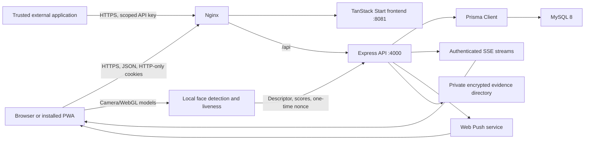
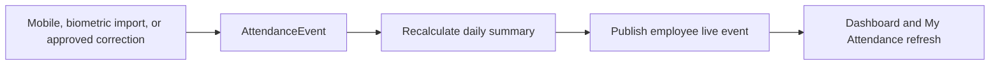

# Technical Overview

## Architecture

The frontend never connects directly to MySQL. Authorization and object-level access are enforced by Express before Prisma queries run.

## Technology Stack

| Concern                  | Technology and responsibility                                                          |
| ------------------------ | -------------------------------------------------------------------------------------- |
| Browser UI               | React 19, TanStack Start/Router, TypeScript 5.9, Vite 8 and Tailwind CSS 4             |
| Accessible UI primitives | Radix UI, shared responsive dialogs/tables/`ResponsiveList`, Lucide icons and Recharts |
| API and validation       | Node.js 22, Express 4, Zod 3 and rate-limited JSON endpoints                           |
| Persistence              | MySQL 8, Prisma 6 schema/migrations and transactional writes                           |
| Authentication           | bcrypt password hashing, signed JWT cookies, origin validation and backend RBAC        |
| Live application state   | Authenticated Server-Sent Events, Web Push and service-worker PWA support              |
| Face verification        | Self-hosted Human 3 WebGL models, one-time challenges and encrypted server storage     |
| Verification             | Vitest 4, Playwright, ESLint 10, Prettier 3, TypeScript and repository/database audits |

The same runtime can be hosted on one Ubuntu VM or split into frontend, backend, and managed MySQL
services. The container contract, secrets inventory, proxy settings, and receiving-company
acceptance process are documented in [Third-Party Technical Handover](THIRD_PARTY_HANDOVER.md).
Supported AWS patterns and their scaling constraints are documented in
[AWS Deployment Patterns](AWS_DEPLOYMENT_PATTERNS.md).

## Runtime Modules

| Path                               | Responsibility                                                           |
| ---------------------------------- | ------------------------------------------------------------------------ |
| `server/src/app.ts`                | API routes and feature orchestration                                     |
| `server/src/security.ts`           | Password hashing, tokens, cookies, and auth middleware                   |
| `server/src/rbac.ts`               | Roles, hierarchy access, and team visibility                             |
| `server/src/schemas.ts`            | Zod request validation                                                   |
| `server/src/attendanceEngine.ts`   | Attendance event creation and summary recalculation                      |
| `server/src/attendanceDayRules.ts` | Workday, holiday, leave, and weekly-off settlement                       |
| `server/src/leavePolicy.ts`        | Protected leave policies, accrual, validation, and credit sync           |
| `server/src/attendanceLive.ts`     | Employee-scoped live attendance refresh                                  |
| `server/src/faceAttendance.ts`     | Face sessions, matching, encrypted evidence, settings, and cleanup       |
| `server/src/notificationLive.ts`   | Authenticated live notification refresh                                  |
| `server/src/push.ts`               | VAPID Web Push delivery and stale subscription cleanup                   |
| `server/src/mapper.ts`             | Safe API DTOs and status mapping                                         |
| `server/src/integration-api.ts`    | Versioned Employee API, service credentials, concurrency and change feed |
| `src/services/api/index.ts`        | Central frontend API client                                              |
| `src/lib/auth.tsx`                 | Browser session restore and auth state                                   |
| `src/lib/attendance-live.ts`       | Attendance EventSource client                                            |
| `src/lib/notification-live.ts`     | Notification EventSource client                                          |
| `public/sw.js`                     | App shell cache, Web Push display, notification actions, and offline shell |
| `public/manifest.webmanifest`      | PWA identity, icons, shortcuts, and install display mode                   |
| `src/lib/pwa-install.ts`           | Platform install detection and Home Screen guidance                        |
| `src/components/layout/PwaInstallBanner.tsx` | Post-login install banner for Android/iOS/Windows/Mac               |
| `src/components/face/`             | Mandatory enrollment and responsive attendance camera flows              |

## Authentication

1. `POST /auth/login` verifies the password.
2. Normal accounts lock after five consecutive failures; a successful login resets the counter.
3. Access and refresh JWTs are placed in HTTP-only cookies.
4. First-login users must replace the temporary password and are automatically authenticated afterward.
5. When Developer Admin enables employee face verification, every normal account must submit and
   obtain approval for face registration. Developer Admin remains exempt.
6. While enabled, backend middleware blocks protected APIs until
   `face_profiles.status = APPROVED`; the frontend full-screen gate mirrors that policy. When
   verification is paused, normal access and GPS-only attendance continue without deleting
   approved templates.
7. `/auth/restore` restores eligible sessions from the refresh cookie.
8. Suspended, inactive, and locked accounts cannot restore a browser session.
9. Access and refresh tokens include the current `users.session_version`. Authenticated requests
   reload account state from MySQL; password changes/resets, role-sensitive account updates,
   suspension, deactivation, and logout increment the version and invalidate older cookies.

Developer Admin is protected from failed-password lockout and cannot be suspended, deactivated, or deleted.

Module access is defense in depth. The application layout blocks disabled routes for usability,
and backend middleware maps protected API groups to their module before route handlers run. Role,
ownership, hierarchy, and board-access checks still apply inside each domain.

## Data Statuses

User login state and employee operational state are deliberately separate.

- `User.status`: `ACTIVE`, `INACTIVE`, or `LOCKED`
- Scheduled suspension: `suspensionStartsAt` and `suspendedUntil`
- `Employee.status`: `ACTIVE`, `INACTIVE`, or `TERMINATED`

Lockout or suspension does not delete or disable the employee record, allowing historical reporting, task assignment, and future biometric imports to remain intact.

## Main API Groups

| Prefix                  | Purpose                                                                                     |
| ----------------------- | ------------------------------------------------------------------------------------------- |
| `/auth`                 | Login, restore, logout, password change/reset                                               |
| `/users`                | Account creation, lifecycle, reset, and history-preserving deactivation                     |
| `/employees`            | Directory, details, organization placement, and birthdays                                   |
| `/departments`          | Organization hierarchy and unit heads                                                       |
| `/branches`             | Branches and server-side geofence configuration                                             |
| `/attendance`           | Mobile events, timelines, summaries, reports, corrections, and live stream                  |
| `/face`                 | Enrollment/status, challenges, Developer Admin review, evidence, and policy                 |
| `/leave`                | Leave types, requests, cancellation, approvals, and reports                                 |
| `/weekly-offs`          | Date-specific weekly-off requests and direct-head approval                                  |
| `/holidays`             | Active holiday calendar and branch scope                                                    |
| `/tasks`                | Board directory, list/Kanban/timeline views, versioned tasks, filters, and typed activity   |
| `/task-boards`          | Versioned board configuration, ordered stages, access policies, archive, and restore        |
| `/assets`               | Physical/online assets, return checklists, and company investment per employee calculations |
| `/api/v1`               | Scoped server-to-server employee master data and ordered employee change feed               |
| `/integration-clients`  | Developer Admin credential creation, listing, expiry and revocation                         |
| `/expense-claims`       | Employee-scoped advances/expenses and HR review/payment workflow                            |
| `/certificate-requests` | Employee-scoped HR document requests and HR fulfilment                                      |
| `/announcements`        | Publishing, activation, expiry, and permanent announcement deletion                         |
| `/notifications`        | User-scoped notification feed and live stream                                               |
| `/push`                 | VAPID key and browser subscription management                                               |
| `/audit-logs`           | Administrative audit history                                                                |
| `/system`               | Health, module access, and protected Developer Admin test-data reset                        |

Large collection endpoints support `limit` and `offset`. Operational screens load the first 100 records and fetch additional pages on demand. ExcelJS remains in a lazy route chunk so spreadsheet functionality is excluded from the initial application path.

Browser role checks live in `tests/e2e/role-navigation.spec.ts`. Set `E2E_BASE_URL` and `E2E_USERS_JSON` to run the same navigation check against Developer Admin, CEO, HR, head, and employee accounts without storing credentials in source control.

## Attendance Model

Mobile events require a passed `face_evidence` row from a purpose-bound, single-use
`face_verification_sessions` row. The server checks session ownership and expiry, liveness and
anti-spoof thresholds, approved encrypted-template similarity, GPS coordinates, and accuracy before
creating and linking the attendance event. Biometric imports and approved corrections retain their
separate trusted-source workflows.

Every punch is an immutable `AttendanceEvent`. The engine sorts events, pairs compatible in/out sources, calculates worked duration, and maintains one `AttendanceDailySummary` per employee/date. A live event tells the employee’s other signed-in devices to reload the authoritative timeline.

Attendance dates are employee-specific. Day shifts use the India calendar date. Night shifts map events between midnight and the configured shift end to the previous date, allowing biometric and mobile punches to pair across midnight. Shift configuration is stored as `shift_type`, `shift_start_minutes`, and `shift_end_minutes`.

An open session is never closed automatically. After nine hours, the scheduler creates one deduplicated `AttendanceReminder`, sends a targeted push when configured, and keeps the attendance timer running until an explicit checkout resolves the reminder.

The live timer is calculated in the browser from the ordered timeline. Completed pairs are fixed; an unmatched final check-in adds elapsed time until a checkout arrives. After a successful punch response, a temporary optimistic session state updates the buttons and timer immediately. It is removed as soon as the authoritative SSE-refreshed timeline confirms the event.

The Day Logs screen requests `limit=none` only for its explicitly selected attendance range and
groups returned summaries as date -> employee -> timeline in the all-employee view. A selected
employee uses date -> timeline and does not apply a branch filter. The Excel overview derives
`Average Working Time Per Day (HH:MM:SS)` from total worked seconds divided by the employee's
Days Present in the exported records; a zero-day denominator produces `00:00:00`. Export presence
classification requires a status beginning with `Present` or positive worked seconds, preventing
Holiday, Week Off, and Pending Attendance summaries from diluting the average.

## Notifications

Announcement creation writes MySQL first, writes an audit event, broadcasts an authenticated SSE change to open app sessions, and sends Web Push in parallel to registered installed/background devices. Notification queries still apply role and employee scope on the backend.

SSE is in-memory and appropriate for the current single backend process. Before running multiple backend instances, replace the in-memory broadcaster with Redis or another shared pub/sub service.

Express proxy trust is configured with `TRUST_PROXY`. Same-server Nginx uses `loopback`; a direct
single AWS load-balancer hop uses `1`. Production rejects the unrestricted `true` setting. The Vite
preview host allow-list is configured with `VITE_ALLOWED_HOSTS`, allowing a receiving company to
use its own domain without editing source.

## Employee Data Retention

Employee/account removal is a typed, server-validated `DEACTIVATE` operation. One Prisma transaction marks the employee and login inactive, records lifecycle timestamps and an employee change event, and retains attendance, leave, biometric, asset, expense, task, and audit history. Reactivation synchronizes both records. Developer Admin and the current signed-in account cannot be deactivated through this workflow.

Announcement permanent deletion is available to HR and Developer Admin, requires typed confirmation, and removes the announcement while retaining an audit event.

The production data reset is Developer Admin-only and requires both current-password verification and the exact phrase `DELETE ALL TEST DATA`. A single Prisma transaction preserves the acting Developer Admin, its optional employee record, branches, departments, hierarchy, predefined leave policies, and system settings while deleting all testing operational data. It intentionally leaves no reset audit event because audit history itself is part of the requested reset. Always create an external database backup before using it.

## Database and Migrations

- `prisma/schema.prisma`: active MySQL schema
- `prisma/migrations/`: production MySQL migration history
- `prisma/postgresql-migrations/`: read-only archive from the previous PostgreSQL implementation
- `prisma/seed.ts`: first-install/demo baseline; never run casually on production

Use `npm run db:migrate` only during development. Use `npm run db:deploy` in production.

The complete table catalog, canonical employee/account synchronization rules, Employee API v1,
idempotency, optimistic concurrency, event consumption and integrity SQL are documented in
[Employee Data Model and Integration API](EMPLOYEE_DATA_AND_INTEGRATION_API.md). Profile fields,
company hierarchy, encrypted identifiers, and the ID-card contract are documented in
[Employee Profile and ID Card](EMPLOYEE_PROFILE_AND_ID_CARD.md). The read-only database audit and
repair policy are documented in [Database Integrity Audit](DATABASE_INTEGRITY_AUDIT.md).
Face tables, encryption, retention, API contracts, browser requirements, and the self-hosted
security boundary are documented in
[Face Registration and Verified Attendance](FACE_ATTENDANCE_SECURITY.md).

Migration `20260716190000_leave_policy_and_weekly_off` intentionally clears legacy leave requests, balances, and configurable leave types before installing the four protected system policies. Back up production before applying it when historical legacy leave data must be retained externally.

## Engineering Rules

The authoritative placement and file-ownership rules are documented in
[Repository Structure](REPOSITORY_STRUCTURE.md). Local development, migration creation, and the
complete test matrix are documented in [Development and Testing](DEVELOPMENT_AND_TESTING.md).

- Validate requests with Zod and enforce RBAC in backend routes.
- Keep tokens out of localStorage.
- Add a migration for schema changes; never edit a deployed migration.
- Use the central API client rather than direct page-level `fetch` calls.
- Keep loading, error, empty, and mobile card/table states for API-backed list views.
- Prefer `ResponsiveList` helpers for new operational lists so phones never depend on
  horizontal scrolling to read primary fields.
- Keep install/PWA guidance current in `DEVICE_COMPATIBILITY.md` when manifest, service-worker, or
  notification behavior changes.
- Prefer Plus Jakarta Sans through the shared theme font stack for UI text; keep loading states on
  `LoadingState` so brand motion stays consistent.
- Never commit `.env`, database dumps, generated builds, logs, private keys, or credentials.
- Run all required checks in the root README before pushing.
