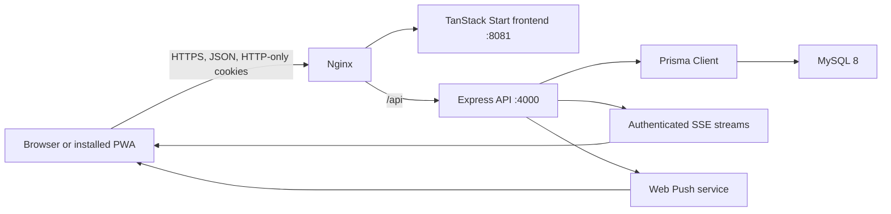
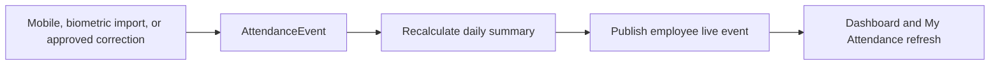

# Technical Overview

## Architecture

The frontend never connects directly to MySQL. Authorization and object-level access are enforced by Express before Prisma queries run.

## Runtime Modules

| Path                               | Responsibility                                                 |
| ---------------------------------- | -------------------------------------------------------------- |
| `server/src/app.ts`                | API routes and feature orchestration                           |
| `server/src/security.ts`           | Password hashing, tokens, cookies, and auth middleware         |
| `server/src/rbac.ts`               | Roles, hierarchy access, and team visibility                   |
| `server/src/schemas.ts`            | Zod request validation                                         |
| `server/src/attendanceEngine.ts`   | Attendance event creation and summary recalculation            |
| `server/src/attendanceDayRules.ts` | Workday, holiday, leave, and weekly-off settlement             |
| `server/src/leavePolicy.ts`        | Protected leave policies, accrual, validation, and credit sync |
| `server/src/attendanceLive.ts`     | Employee-scoped live attendance refresh                        |
| `server/src/notificationLive.ts`   | Authenticated live notification refresh                        |
| `server/src/push.ts`               | VAPID Web Push delivery and stale subscription cleanup         |
| `server/src/mapper.ts`             | Safe API DTOs and status mapping                               |
| `src/services/api/index.ts`        | Central frontend API client                                    |
| `src/lib/auth.tsx`                 | Browser session restore and auth state                         |
| `src/lib/attendance-live.ts`       | Attendance EventSource client                                  |
| `src/lib/notification-live.ts`     | Notification EventSource client                                |
| `public/sw.js`                     | App shell cache, Web Push display, and notification navigation |

## Authentication

1. `POST /auth/login` verifies the password.
2. Normal accounts lock after five consecutive failures; a successful login resets the counter.
3. Access and refresh JWTs are placed in HTTP-only cookies.
4. First-login users must replace the temporary password and are automatically authenticated afterward.
5. `/auth/restore` restores eligible sessions from the refresh cookie.
6. Suspended, inactive, locked, and deleted accounts cannot restore a browser session.

Developer Admin is protected from failed-password lockout and cannot be suspended, deactivated, or deleted.

## Data Statuses

User login state and employee operational state are deliberately separate.

- `User.status`: `ACTIVE`, `INACTIVE`, or `LOCKED`
- Scheduled suspension: `suspensionStartsAt` and `suspendedUntil`
- `Employee.status`: `ACTIVE`, `INACTIVE`, or `TERMINATED`

Lockout or suspension does not delete or disable the employee record, allowing historical reporting, task assignment, and future biometric imports to remain intact.

## Main API Groups

| Prefix         | Purpose                                                                    |
| -------------- | -------------------------------------------------------------------------- |
| `/auth`        | Login, restore, logout, password change/reset                              |
| `/users`       | Account creation, lifecycle, reset, and permanent deletion                 |
| `/employees`   | Directory, details, organization placement, and birthdays                  |
| `/departments` | Organization hierarchy and unit heads                                      |
| `/branches`    | Branches and server-side geofence configuration                            |
| `/attendance`  | Mobile events, timelines, summaries, reports, corrections, and live stream |
| `/leave`       | Leave types, requests, cancellation, approvals, and reports                |
| `/weekly-offs` | Date-specific weekly-off requests and direct-head approval                 |
| `/holidays`    | Active holiday calendar and branch scope                                   |
| `/tasks`       | Multi-assignee tasks and updates                                           |
| `/assets`      | Physical/online assets, return checklists, and investment calculations     |

Large collection endpoints support `limit` and `offset`. Operational screens load the first 100 records and fetch additional pages on demand. ExcelJS remains in a lazy route chunk so spreadsheet functionality is excluded from the initial application path.

Browser role checks live in `tests/e2e/role-navigation.spec.ts`. Set `E2E_BASE_URL` and `E2E_USERS_JSON` to run the same navigation check against Developer Admin, CEO, HR, head, and employee accounts without storing credentials in source control.
| `/expense-claims` | Employee-scoped claims and HR approval/payment workflow |
| `/certificate-requests` | Employee-scoped certificate requests and HR fulfilment |
| `/announcements` | Publishing, activation, expiry, and permanent deletion |
| `/notifications` | User-scoped notification feed and live stream |
| `/push` | VAPID key and browser subscription management |
| `/audit-logs` | Administrative audit history |
| `/system` | Health and Developer Admin system information |

## Attendance Model

Every punch is an immutable `AttendanceEvent`. The engine sorts events, pairs compatible in/out sources, calculates worked duration, and maintains one `AttendanceDailySummary` per employee/date. A live event tells the employee’s other signed-in devices to reload the authoritative timeline.

The live timer is calculated in the browser from the ordered timeline. Completed pairs are fixed; an unmatched final check-in adds elapsed time until a checkout arrives. After a successful punch response, a temporary optimistic session state updates the buttons and timer immediately. It is removed as soon as the authoritative SSE-refreshed timeline confirms the event.

## Notifications

Announcement creation writes MySQL first, writes an audit event, broadcasts an authenticated SSE change to open app sessions, and sends Web Push in parallel to registered installed/background devices. Notification queries still apply role and employee scope on the backend.

SSE is in-memory and appropriate for the current single backend process. Before running multiple backend instances, replace the in-memory broadcaster with Redis or another shared pub/sub service.

## Permanent Deletion

Permanent account deletion is Developer Admin-only and requires a typed server-validated confirmation. One Prisma transaction removes user-specific employee, attendance, leave, biometric mapping, asset, and task data. The acting admin and a non-identifying deletion summary remain in audit history. Developer Admin and the current signed-in account cannot be deleted.

Announcement permanent deletion is available to HR and Developer Admin, requires typed confirmation, and removes the announcement while retaining an audit event.

## Database and Migrations

- `prisma/schema.prisma`: active MySQL schema
- `prisma/migrations/`: production MySQL migration history
- `prisma/postgresql-migrations/`: read-only archive from the previous PostgreSQL implementation
- `prisma/seed.ts`: first-install/demo baseline; never run casually on production

Use `npm run db:migrate` only during development. Use `npm run db:deploy` in production.

Migration `20260716190000_leave_policy_and_weekly_off` intentionally clears legacy leave requests, balances, and configurable leave types before installing the four protected system policies. Back up production before applying it when historical legacy leave data must be retained externally.

## Engineering Rules

- Validate requests with Zod and enforce RBAC in backend routes.
- Keep tokens out of localStorage.
- Add a migration for schema changes; never edit a deployed migration.
- Use the central API client rather than direct page-level `fetch` calls.
- Keep loading, error, empty, and mobile states for API-backed views.
- Never commit `.env`, database dumps, generated builds, logs, private keys, or credentials.
- Run all required checks in the root README before pushing.
