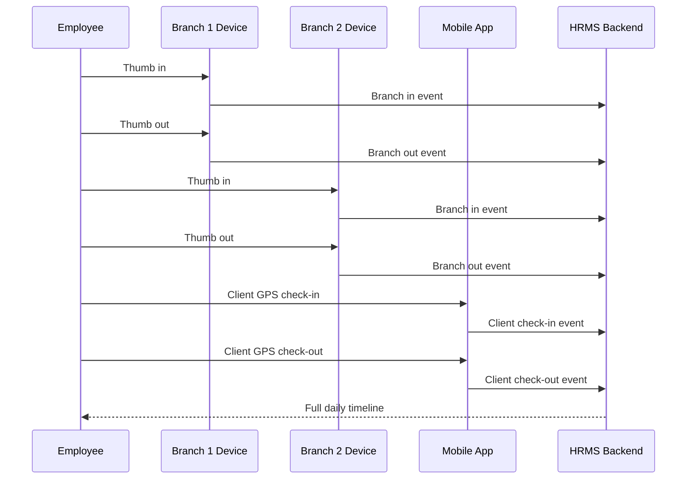
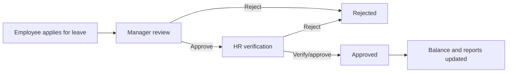

# Anytime Diesel HRMS User Guide

This guide explains how HR, managers, employees, field staff, and leadership use the Anytime Diesel HRMS application.

## Who Can Do What

| Area                           | Developer Admin                                            | Main Admin                                                 | HR                                                 | CEO                     | Manager                     | Employee / Sales / Driver / Field Staff |
| ------------------------------ | ---------------------------------------------------------- | ---------------------------------------------------------- | -------------------------------------------------- | ----------------------- | --------------------------- | --------------------------------------- |
| Dashboard                      | Full system view                                           | Admin view                                                 | HR operations view                                 | Summary/report view     | Team view                   | Personal view                           |
| User logins                    | Create, edit, suspend, deactivate, delete, reset passwords | Create, edit, suspend, deactivate, delete, reset passwords | Create, edit, suspend, deactivate, reset passwords | View only where allowed | No                          | No                                      |
| Employees                      | Full access                                                | Full access                                                | Full access                                        | Summary/report access   | Assigned team only          | Own profile only                        |
| Departments                    | Add, edit, delete, assign department heads                 | As configured                                              | As configured                                      | View reports            | No                          | No                                      |
| Branches                       | Add, edit, deactivate                                      | Add, edit, deactivate                                      | Add, edit, deactivate                              | View reports            | View assigned/team data     | No                                      |
| Biometric devices and mappings | Add, edit, deactivate, map employees                       | Add, edit, deactivate, map employees                       | Add, edit, deactivate, map employees               | View reports            | View team attendance        | No                                      |
| Attendance                     | Full operational access                                    | Full operational access                                    | Full operational access                            | Reports and summaries   | Assigned team only          | Own attendance only                     |
| Leave policy and types         | Add, edit, delete                                          | Add, edit, delete                                          | Add, edit, delete                                  | View reports            | Approve assigned team leave | Apply and track own leave               |
| Holidays                       | Add, edit, delete                                          | Add, edit, delete                                          | Add, edit, delete                                  | View                    | View                        | View                                    |
| Audit logs                     | View                                                       | View                                                       | No                                                 | No                      | No                          | No                                      |
| System settings                | Full access                                                | Full access                                                | Limited security settings                          | No                      | No                          | No                                      |

## Login And First Password Change

1. Open the application URL.
2. Enter the email and temporary password given by HR or Admin.
3. If the account requires a first password change, enter a new password.
4. After changing the password, the application signs the user in automatically.

Public signup is disabled. All accounts must be created by HR, Main Admin, or Developer Admin.

## HR: Create A New Login

1. Open **User Logins**.
2. Select **Create Login**.
3. Choose the employee details, role, department, branch, reporting manager, gender, and employment type.
4. Choose whether to use the predefined temporary password or enter a custom temporary password.
5. Save the login.
6. Share the login email and temporary password with the employee.

Notes:

- Reporting manager must be active and must have an allowed leadership role.
- Employees cannot be their own reporting manager.
- Account creation and manager changes are recorded in audit logs.

## HR/Admin: Suspend Or Deactivate A Login

Use **User Logins** for account lifecycle actions.

- **Suspend**: blocks login only for the selected date window. Attendance and employee history remain in the database.
- **Deactivate**: turns off the login until HR/Admin reactivates or updates it.
- **Permanent delete**: removes the login/employee data according to the backend delete behavior. Use only when the company really wants to remove the account.

Employees receive account suspension notifications before the suspension date where the scheduled suspension notification feature is active.

## HR/Admin: Update The Predefined Temporary Password

1. Open **System Settings**.
2. Find **Predefined New Account Password**.
3. Enter a strong new temporary password.
4. Save.

Only the password hash is stored in MySQL. Existing users keep their own passwords.

## Employee: Mark Attendance

Employees can use biometric attendance, mobile attendance, or both depending on their employee attendance mode.

1. Open **My Attendance**.
2. Review today's timeline.
3. Use mobile check-in or check-out when allowed.
4. Biometric punches from eSSL/fingerprint devices appear in the same daily timeline after they are imported or synced into the backend.

Example movement timeline:

## Employee: Request Missed Punch Correction

1. Open **Missed Punch Request**.
2. Select the date and punch time.
3. Select the missing event type.
4. Add a clear reason.
5. Submit.

Managers/HR can approve or reject corrections from **Attendance Corrections**.

## Employee: Apply For Leave

1. Open **Apply Leave**.
2. Select leave type.
3. Select from and to dates.
4. Enter the number of days and reason.
5. Submit.

The request moves through manager and HR review according to the configured workflow.

## Manager: Review Team Leave And Attendance

Managers see only assigned team members.

Use:

- **Attendance Overview** for team attendance.
- **Branch Attendance** for branch-wise activity.
- **Field Attendance** for GPS/client work.
- **Attendance Corrections** for missed punch requests.
- **Leave Approvals** for team leave.

## HR: Manage Leave Types

1. Open **Leave Policy**.
2. Add, edit, or delete leave types.
3. Mark each type as paid or unpaid.

Changes affect future leave applications and reports.

## HR/Admin: Manage Departments And Department Heads

1. Open **Departments**.
2. Add or edit a department.
3. Select the department head from active employees.
4. Save.

Department head assignment is stored on the department record and can be changed later by authorized admin users.

## HR/Admin: Manage Branches

1. Open **Branches**.
2. Add a new branch with code, name, city, address, and status.
3. Edit details when a branch changes.
4. Deactivate/delete only when the branch should no longer be used operationally.

## HR/Admin: Manage Biometric Devices And Mapping

1. Open **Biometric Devices**.
2. Add the eSSL device details, branch, IP, port, and location.
3. Open device mapping.
4. Link each employee to the biometric user ID from the device.

When eSSL integration is connected, imported device punches should create attendance events for mapped employees.

## Notifications

Notifications are scoped to the signed-in user. Users should see only their own leave, birthday, system, suspension, and relevant workflow notifications.

## Reports

Reports include filters for date range, employee, branch, department, source, status, client name, and field work type where supported.

Common report pages:

- Employee attendance report
- Branch-wise attendance report
- Multi-branch movement report
- Field attendance report
- Client visit report
- Leave report
- Payroll attendance summary

## Mobile Use

The app is designed for both laptop and mobile screens.

Recommended mobile workflows:

- Employees: My Attendance, Apply Leave, Leave History, Notifications, My Profile.
- Field staff: My Attendance with GPS check-in/check-out and client visit details.
- Managers: Leave Approvals and team attendance review.
