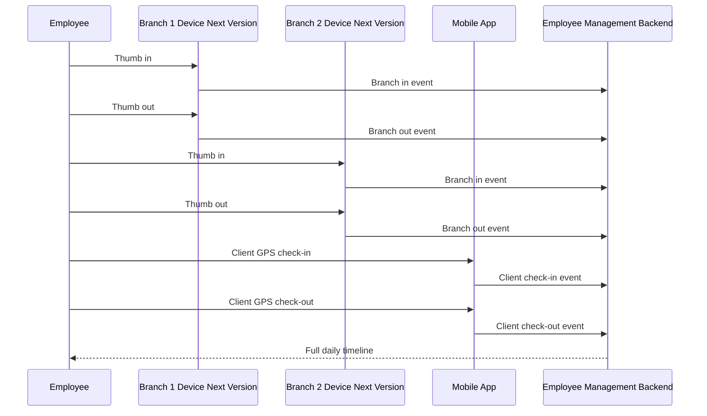
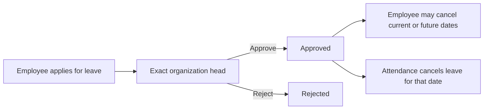

# Anytime Diesel Employee Management System User Guide

This guide explains how Developer Admin, HR, organization heads, employees, field staff, and leadership use the Anytime Diesel Employee Management System.

## Who Can Do What

| Area                           | Developer Admin                                                | Main Admin              | HR                      | CEO                   | Manager                     | Employee / Sales / Driver / Field Staff |
| ------------------------------ | -------------------------------------------------------------- | ----------------------- | ----------------------- | --------------------- | --------------------------- | --------------------------------------- |
| Dashboard                      | Full system view                                               | Admin view              | HR operations view      | Summary/report view   | Team view                   | Personal view                           |
| User logins                    | Create, edit, suspend, deactivate, reactivate, reset passwords | No                      | No                      | No                    | No                          | No                                      |
| Employees                      | Full access                                                    | Full access             | Full access             | Summary/report access | Assigned team only          | Own profile only                        |
| Departments                    | Add, edit, delete, assign department heads                     | Reference access        | Reference access        | Reference access      | Reference access            | No                                      |
| Branches                       | Add, edit, deactivate                                          | Add, edit, deactivate   | Add, edit, deactivate   | View reports          | View assigned/team data     | No                                      |
| Biometric devices and mappings | Planned next version                                           | Planned next version    | Planned next version    | Planned next version  | Planned next version        | No                                      |
| Attendance                     | Full operational access                                        | Full operational access | Full operational access | Reports and summaries | Assigned team only          | Own attendance only                     |
| Leave policy and types         | View protected types; adjust credits                           | As configured           | View; adjust credits    | View reports          | Approve assigned team leave | Apply and track own leave               |
| Holidays                       | Add, edit, delete                                              | Add, edit, delete       | Add, edit, delete       | View                  | View                        | View                                    |
| Audit logs                     | View                                                           | View                    | No                      | No                    | No                          | No                                      |
| Asset management               | Full access                                                    | No                      | Full access             | Read-only investment  | No                          | No                                      |
| Expenses and HR documents      | Review all                                                     | No                      | Review all              | View all              | Own requests                | Own requests                            |
| System settings                | Full access                                                    | As configured           | No                      | No                    | No                          | No                                      |

## CEO Workspace

The CEO workspace is a read-only company overview. CEO accounts do not mark attendance and are
excluded from automatic absence settlement.

The dashboard shows:

- total workforce, employees present, employees on leave, pending leave decisions, attendance
  exceptions, and employees whose attendance is not settled;
- organization-wide task delivery totals for active, overdue, review, and completed work;
- the number of employees with assigned assets, monthly recurring investment, and estimated
  first-year investment;
- branch attendance coverage, detailed employee attendance, and upcoming birthdays; and
- a downloadable attendance summary.

Use the executive navigation shortcuts or sidebar:

- **Workforce** opens organization-wide employee information.
- **Attendance Overview** opens date, employee, branch, source, and movement details.
- **Work Planner** opens organization-wide tasks, owners, due dates, and activity.
- **Leave Overview** opens leave status and approval progress.
- **Company Investment** opens read-only physical and online asset investment by employee.

Employee Services, attendance marking, user provisioning, company setup, and system controls are
not shown in the CEO login.

## Responsive Navigation

- On phones, use the menu icon in the top-left corner. Selecting a page closes the menu.
- Keyboard users can press Tab once to reveal **Skip to main content**.
- The mobile header shows the current page name and keeps search, notifications, and profile
  controls available.
- Page actions stack on narrow screens and move into a compact row when space is available.
- Most operational lists (attendance, leave, employees, users, devices, audit, assets) show
  card summaries on phones and full tables on tablets and desktops.
- Wide desktop-only tables may still scroll horizontally inside their section; the page itself
  does not widen.
- Work Planner filters stack on phones; timeline view shows assignee groups as cards on phones
  and the full timeline from tablet size upward.
- After sign-in, an install banner can help you add Anytime Diesel Employees to Android, iPhone,
  Windows, or Mac. Open **Notifications** for alert status and installation steps.
- The same permissions apply on mobile, tablet, laptop, and installed PWA displays.

## Login And First Password Change

1. Open the application URL.
2. The sign-in screen shows the Anytime Diesel crew mascot at the top. While you type your
   password (with it hidden), he covers his eyes. If you reveal the password, he peeks again.
3. Enter the work email and temporary password issued by the Developer Admin.
4. There is one shared sign-in screen for every role. After authentication, the app opens the
   matching workspace automatically (employee, manager, HR, CEO, Main Admin, or Developer Admin).
5. The dashboard shows today's birthday cards (if any), urgent/recent announcements, and a
   **Quick access** grid tailored to that role.
6. Sidebar groups are ordered by role so everyday actions appear first.
7. If the account requires a first password change, enter a new password.
8. After changing the password, the face-registration screen opens for normal accounts when
   Developer Admin has enabled employee face verification.
9. Accept the biometric-consent statement, allow the camera, centre one uncovered face, and complete
   the blink or head-turn prompt.
10. Developer Admin is exempt from face authentication. Normal accounts wait on the blocking
    approval screen until Developer Admin approves them in **Face Security**.
11. A rejected registration displays the reason and allows a new capture.

Public signup is disabled. All accounts are created by the Developer Admin. Use **Need help?** on
the login screen for password-reset guidance.

The login mascot animation respects reduced-motion preferences and falls back to the company logo
if the mascot image cannot load, so sign-in remains usable.

## Dashboard Communications Order

On every dashboard the company communications appear in this order:

1. Today's birthday celebration card(s) — your own card first when applicable
2. Active announcements — urgent, then important, then normal; newest within each level
3. Role-specific quick access shortcuts
4. Role dashboard widgets (attendance, team summaries, upcoming birthdays list)

Open **Announcements** from the Me menu or Quick access for the full board. The same priority
order is used on the announcements page.

## Developer Admin: Create A New Login

1. Open **User Logins**.
2. Select **Create Login**.
3. Select the employer company: Anytime Diesel, Fuelistic Innovations Private Limited, or Royal
   Petro Park Private Limited.
4. Enter identity, personal/company phone, organization, reporting manager, joining, banking,
   statutory, and optional attendance-location details.
5. Enter a temporary password for this account.
6. Save the login and share the email and temporary password with the employee.

Notes:

- Leave and team workflows follow the organization-unit head hierarchy.
- Account creation and organization changes are recorded in audit logs.
- Bank account number, PAN, Aadhaar, and UAN are encrypted. They are not exported through the
  general Employee API.

### Bulk Import Employee Logins

Developer Admin can select **Bulk import** on **User Logins** and download the current `.xlsx`
template. Always download a fresh copy because its reference sheets contain the current companies,
attendance branches, organization units, and reporting managers.

The Employees sheet supports:

- employee code, full name, email, temporary password, personal phone, and company phone;
- employer company, optional attendance branch, main/child organization unit, designation,
  organization level, and reporting manager;
- joining date, date of birth, gender, employment type, and blood group; and
- account holder name, account type, account number, IFSC, PAN, Aadhaar, and optional UAN.

Application role is intentionally not imported directly. The backend derives it from the selected
organization unit and level, preventing a spreadsheet from granting an unauthorized role.
Reporting Manager accepts an existing employee code/email, a code/email from another row in the
same workbook, or `Automatic`. Same-workbook managers are created before their reports.

The upload validates all rows before enabling import, including duplicate accounts, unit hierarchy,
dates, manager references, passwords, and statutory formats. Up to 500 employees can be processed
in one workbook. Every successful row creates the login and canonical employee record through the
normal backend transaction, so encryption, role assignment, employee change events, and audit logs
remain active.

Replace or delete every example row before importing. Rows retaining a `SAMPLE-...` employee code
or the sample email are rejected. Import is row-atomic: a successful row remains saved when a later
row fails, and the result panel identifies exactly which rows must be corrected and retried.

The workbook contains plaintext temporary passwords and any private information entered. Restrict
access to it and permanently delete local/email copies after confirming a successful import.

## Employee: Review My Profile And ID Card

**My Profile** displays identity/contact information first, employment and company information
second, followed by banking and statutory details. Sensitive identifiers are masked until the
employee selects the show icon. Attendance access, shift, work assignment, account status, and
attendance location are intentionally kept out of this personal profile.

**Employee ID Card** displays the selected employer and Royal Petro Park Private Limited group,
employee code, designation, department, role, joining date, blood group, and company contact
number. The QR verification page exposes only the minimum active-employment details.

## Developer Admin: Suspend, Deactivate, Or Reactivate A Login

Use **User Logins** for account lifecycle actions.

- **Suspend**: blocks login only for the selected date window. Attendance and employee history remain in the database.
- **Deactivate**: turns off the login until the Developer Admin reactivates it.
- **Blocked**: five consecutive incorrect passwords block login. Only the Developer Admin can reactivate it. Attendance history, biometric mappings, and task assignments are retained.

Employees receive account suspension notifications before the suspension date where the scheduled suspension notification feature is active.

## Developer Admin: Deactivate An Account And Retain History

Use deactivation when an employee should no longer sign in or appear as active.

1. Open **User Logins**.
2. Select **Deactivate account** for the intended user.
3. Review the displayed list of profile, attendance, leave, biometric, asset, expense, task, and audit data that will be retained.
4. Type `DEACTIVATE` exactly.
5. Confirm deactivation.

The employee and login are marked inactive together. The current signed-in account and Developer Admin accounts cannot be deactivated. Developer Admin can reactivate the account later.

## Developer Admin: Reset Testing Data Before Go-Live

Use **System Settings > Production Data Reset** only once the testing period is complete and immediately before entering real employee data.

1. Take and verify a MySQL backup.
2. Sign in with the Developer Admin account that must be preserved.
3. Open **System Settings** and select **Delete all testing data**.
4. Type `DELETE ALL TEST DATA` exactly and enter the current Developer Admin password.
5. Confirm the reset, then verify that User Logins contains only the preserved Developer Admin account.
6. Create the real organization logins from Developer Admin.

The reset preserves the signed-in Developer Admin account, password, branches, departments and
their hierarchy, predefined leave policies, and system settings. Developer Admin remains exempt
from face authentication. The reset clears department-head assignments because the testing
employees are removed. It permanently removes all other users, employees, face
registrations/evidence, attendance, leave balances and requests, tasks, assets, holidays, biometric
devices and mappings, announcements, subscriptions, service requests, notifications derived from
those records, and audit history. The database deletion is transactional; encrypted files belonging
to removed users are purged immediately afterward.

Follow the complete verification and real-data setup sequence in [Reset and Go-Live](RESET_AND_GO_LIVE.md).

## Developer Admin: Create Or Revoke Employee API Access

1. Open **System Settings > Employee API Access**.
2. Enter the trusted application's name and optional expiry date.
3. Select only the required read, write, or event-feed scopes.
4. Select **Create API key** and copy the key immediately; it is shown only once.
5. Store it in the consuming server's secret manager, never in frontend code or source control.
6. Use **Revoke** when the application is retired or the key may have been exposed.

The list shows key prefix, scopes, status, expiry, and last use without exposing the secret. Detailed
integration examples and recovery procedures are in **Employee Data Model and Integration API**.

## Employee: Mark Attendance

Developer Admin assigns each employee a day or night shift and its start/end times while creating the account or from **Employees > Edit Employee**. For night shifts, punches after midnight and before the configured shift end remain part of the date on which the shift started. Mobile and biometric punches can be mixed within the same session.

Employees can use mobile attendance in the current version. Biometric/eSSL attendance is planned for the next version.

1. Open the Dashboard or **My Attendance** and review today's timeline.
2. For **Check In**, allow the front camera and precise location.
3. Keep exactly one face inside the oval, complete the head-turn prompt, return to the centre, and
   hold still while five stable frames are securely compared.
4. Clear spectacles are supported. Reduce glare if it covers the eyes; remove masks and
   dark/tinted glasses.
5. A different person produces an **Another face detected** popup, is visible in Developer Admin
   **Face Security**, and does not create check-in.
6. For **Check Out**, only precise location is requested; the camera does not open.
7. The operation cannot continue when required permission is denied or GPS accuracy is outside
   policy.
8. Future eSSL/fingerprint imports can appear in the same daily timeline through the separate
   biometric integration workflow.

When Developer Admin pauses face verification, check-in does not open the camera and requires only
fresh precise location. Existing approved registrations remain ready for later re-enablement.

After a successful mobile punch, the status and timer update immediately while the live server timeline refreshes. Keep the page open if the network is slow; the punch button remains disabled while the request is pending to prevent duplicate submissions. Other signed-in devices update through the attendance live stream.

## Employee: Claim An Expense

1. Open **Employee Services** and select **Expenses**.
2. Select **New claim**.
3. Enter title, amount, expense date, description, and a Google Drive attachment link.
4. In Google Drive, set General access to **Anyone with the link** and role to **Viewer**, then select the confirmation checkbox.
5. Submit. The request goes directly to HR.
6. Track Pending, Unpaid, Rejected, or Paid status and read the HR note on the same page.

HR reviews a pending claim first. A claim must be Unpaid before HR can mark it Paid. Payment processing itself remains an HR/accounting action outside the portal.

## Employee: Request An HR Document

1. Open **Employee Services** and select **HR Documents**.
2. Select **New request**.
3. Choose document type, digital or printed delivery, optional required-by date, and explain the purpose.
4. Track Pending, In Progress, Ready, Rejected, or Collected status.
5. Open the document link when HR attaches a completed digital document.

Employees see only their own requests. HR and Developer Admin see the complete request queues.

Example movement timeline:

## Employee: Request Missed Punch Correction

An unmatched check-in remains active until the employee checks out. After nine hours, the employee receives one reminder that attendance is still running; the timer and session continue normally.

1. Open **Missed Punch Request**.
2. Select the date and punch time.
3. Select the missing event type.
4. Add a clear reason.
5. Submit.

Managers/HR can approve or reject corrections from **Attendance Corrections**.

## Employee: Apply For Leave

1. Open **Apply Leave**.
2. Select leave type.
3. Select from and to dates.
4. Enter the number of days and reason.
5. Submit.

The screen shows the current balance and full rules for Casual Leave, Sick Leave, Unpaid Leave / LOP, and Comp Off. Sick Leave accepts a shareable Google Drive report link. If it is not available when applying, add it from **Leave History** within three days after returning; the countdown is shown there.

Comp Off credits are valid only until December 31 of the year they are earned. Unused credits expire and cannot be requested in a later year.

### Request a weekly off

Weekly off is selected through this request flow, not while the account is created or edited.

1. Open **Apply Leave** and use **Request weekly off**.
2. Select a date at least one day in advance.
3. Submit it to the direct organization head.

Only one date is allowed in each Monday-Sunday week. It expires unused, does not carry forward, and cannot be consecutive with another weekly off, including Sunday followed by Monday.

The request is assigned to the nearest organization-unit head above the employee. Only that exact head can approve or reject it.

## Work Planner

Open **Work Planner** to see every task board available to your account. **Assigned to me** keeps
your active work at the top so you can open a task without first finding its board. Active boards
show their access policy and open-task count. Archived boards remain recoverable and do not accept
new work until their owner restores them.

### Open and navigate a board

1. Select an active board card. The header shows total and active work.
2. Search by title, description, or assignee.
3. Use **Mine**, assignee, priority, stage, and due-date filters together.
4. Select a stage total to focus the board on that stage; select it again to clear the filter.
5. Switch among:
   - **List** for compact, collapsible stage groups and inline stage changes.
   - **Kanban** for visual workflow columns and drag-and-drop stage movement.
   - **Timeline** for start/due-date planning grouped by primary assignee.
6. Use the board selector to move directly to another accessible board.

All wide controls and Kanban/timeline content scroll horizontally on narrow screens. Selecting a
task opens one focused, full-height mobile dialog containing its description, assignees, dates,
progress, and complete activity history.

### Find and update work

1. Select a task row, card, timeline bar, or **Assigned to me** entry.
2. Review the current stage, priority, owners, schedule, and prior updates.
3. Change the stage from the detail panel, or from the list stage selector. In Kanban, drag the card
   to another column.
4. Enter a decision, progress note, or blocker; set the resulting progress; then select
   **Post update**.

If another session saved the task first, the app shows a refresh message and does not overwrite the
newer change.

### Create a task

Open a board and select **New task**, or use **Add task** within a specific stage.

1. Add a short outcome-focused title.
2. Select a starting stage and priority.
3. Add details, start date, and due date as needed. The due date cannot be earlier than the
   start date.
4. Select one or more active assignees. The selection is automatically restricted to employees
   allowed by the board and your organization scope.
5. Select **Create task**. The assignment, stage, canonical status, and creation activity are stored
   together.

### Create or configure a board

Authorized leaders select **New board**. Add a professional name and optional purpose, then configure
the workflow:

1. Rename stages and choose their colors.
2. Move stages up or down to set the display order.
3. Add custom stages or remove empty stages.
4. Keep at least one **To do** stage and mark exactly one stage as **Done**.
5. Choose the access policy:
   - **Open**: every account with Work Planner module access.
   - **Role-gated**: only selected application roles.
   - **Member-gated**: only selected active employees.
6. Select **Create board** or **Save changes**.

Only the board owner or Developer Admin can change, archive, or restore it. A stage containing tasks
cannot be removed until the tasks are moved. Access cannot be narrowed in a way that would hide a
current task from one of its assignees.

## Manager: Review Team Leave And Attendance

Organization heads see employees within their permitted unit hierarchy. Leave actions show only requests assigned directly to that head; a super-head cannot approve or reject a lower head's assigned request.

Use:

- **Attendance Overview** for team attendance.
- **Branch Attendance** for branch-wise activity.
- **Field Attendance** for GPS/client work.
- **Attendance Corrections** for missed punch requests.
- **Leave Approvals** for team leave.

In **Leave Approval Queue**, review the request dates, reason, assigned approver, and credit
projection. Approval notes are optional. A rejection reason of at least three characters is required
and is shown to the employee in **Leave History**. HR may see requests across the organization, but
only the exact assigned organization head receives action buttons.

## HR: Manage Leave Policies And Credits

1. Open **Leave Policies & Credits**.
2. Review the protected company policy cards.
3. Search for an employee and leave type.
4. Select the edit icon, enter the complete manual adjustment and reason, and save.

Policy types cannot be added, renamed, or deleted. Adjustments are recorded in Audit Logs. Payroll deductions for negative Casual Leave or Unpaid Leave / LOP remain a manual HR responsibility.

### HR: Monitor leave workflow

1. Open **Leave Approvals** to see pending leave and weekly-off requests across the organization.
2. Requests assigned to another organization head are read-only and show who must act.
3. If the signed-in HR employee is the exact assigned head, approve with an optional note or reject
   with a required reason.
4. Open **Leave Tracking** for the permanent read-only register.
5. Search by employee, approver, leave type, or reason; filter by status/type; export the filtered
   result to CSV.
6. For Sick Leave, open the submitted medical-report link and mark it verified. If the employee later
   changes the link, verification is automatically cleared and HR must verify the new document.

## Developer Admin: Manage Departments And Department Heads

1. Open **Departments**.
2. Add or edit a department.
3. Select the department head from active employees.
4. Save.

Department head assignment is stored on the department record. Other authorized roles may receive
department references for directory and report screens, but only Developer Admin changes the
organization structure.

## HR/Admin: Manage Branches

1. Open **Branches**.
2. Add a new branch with code, name, city, address, latitude, longitude, attendance radius, and status.
3. Edit details when a branch changes.
4. Deactivate/delete only when the branch should no longer be used operationally.

## HR/Admin: Manage Biometric Devices And Mapping

Status: planned for the next version. The current application documents the intended eSSL/fingerprint mapping flow, but real device integration is not live yet.

1. Open **Biometric Devices**.
2. Add the eSSL device details, branch, IP, port, and location.
3. Open device mapping.
4. Link each employee to the biometric user ID from the device.

When eSSL integration is added in the next version, imported device punches should create attendance events for mapped employees.

## Holiday Management

1. Open **Holidays**.
2. Add the holiday name, date, classification, and branch scope.
3. Use **All branches** for a company-wide holiday or select one branch.
4. Edit or deactivate the entry when the calendar changes.

Every active entry visible in the Holiday list counts as a holiday for attendance. Public, Optional, and Restricted are classification labels only. At 10:00 AM IST a no-punch employee is marked Holiday; a later punch changes the day to Present. A completed holiday punch-in/out session automatically earns one Comp Off credit. Holiday changes recalculate existing summaries for the affected date and branch.

## Developer Admin: Review Face Registrations

1. Open **Face Security**.
2. Use **Employee verification** to enable or pause face checks. Pausing keeps precise GPS required
   and retains existing encrypted registrations.
3. Review pending users, the encrypted evidence image, scores, time, and any GPS details.
4. A red **Another face detected** alert means a check-in was blocked because the captured face did
   not match that employee.
5. Select **Approve**, or select **Reject** and give a clear correction reason.
6. Use **Reset** when another employee must register again. The account is blocked immediately only
   while verification is enabled.
7. Use the privacy policy card to set capture retention (default five days), match threshold, and
   maximum accepted GPS error.

The evidence dialog lists retained registration and check-in captures. At most the latest five
pictures per person remain available, and none remain longer than the configured retention.
Expired pictures are automatically deleted while non-image audit metadata remains. See
[Face Registration and Verified Attendance](FACE_ATTENDANCE_SECURITY.md).

## Notifications

Notifications are scoped to the signed-in user. Users should see only their own leave, birthday, system, suspension, and relevant workflow notifications.

Open app sessions receive new announcement updates immediately. Installed/background devices can display Web Push after the user grants notification permission. Browser or operating-system denial must be changed in device settings; the application cannot override it.

## HR/Developer Admin: Announcements

1. Open **Announcements**.
2. Select **New announcement**.
3. Enter a clear title, message, priority, and display-until date/time.
4. Publish. Open employee sessions refresh immediately and subscribed devices receive Web Push.
5. Use **Deactivate** to hide an announcement temporarily, or **Reactivate** to restore it.
6. Use **Permanently delete** only when the announcement must be removed. Type `DELETE` to confirm.

## Reports

Reports include filters for date range, employee, branch, department, source, status, client name, and field work type where supported.

In **Day Logs**, selecting **All Employees** shows a date-first hierarchy. Expand a date to
see its employees, then expand an employee to see every punch for that date. Selecting one
employee shows all available dates directly and removes the unnecessary branch filter.

The Day Logs Excel export applies the selected employee, date, and branch filters. Its first
sheet contains one summary row per employee. **Average Working Time Per Day** is calculated as
the employee's total worked time in the exported records divided by **Days Present**. Employees
with no present days show `00:00:00`. Each employee sheet retains the actual worked time for every
individual date. Holiday, Week Off, and Pending Attendance rows do not count as present unless
worked time was actually recorded.

Common report pages:

- Employee attendance report
- Branch-wise attendance report
- Multi-branch movement report
- Field attendance report
- Client visit report
- Leave report
- Payroll attendance summary

## HR And CEO: Review Company Investment Per Employee

Open **Asset Management** and review **Company investment per employee**. This section shows how
much Anytime Diesel currently invests in each employee through physical assets and online services
assigned to that person.

- **One-time invested:** purchase values recorded as one-time costs.
- **Monthly recurring:** monthly subscriptions plus yearly subscriptions normalized to a monthly amount.
- **Annual recurring:** monthly subscriptions multiplied by 12 plus yearly subscriptions.
- **First-year investment:** one-time invested plus annual recurring.

HR and Developer Admin can add, assign, edit, and return assets. CEO access is read-only. Shared
company-use assets such as tables and fans remain in company totals but are not attributed to an
individual employee.

## Mobile Use

The app is designed for phones, tablets, and laptops. See
[DEVICE_COMPATIBILITY.md](DEVICE_COMPATIBILITY.md) for the iPhone, Pixel, Samsung, Vivo, Oppo,
tablet, and desktop release checklist, and [RESPONSIVE_UI_AUDIT.md](RESPONSIVE_UI_AUDIT.md) for
shared layout and accessibility standards.

Recommended mobile workflows:

- Install the app to the Home Screen / desktop for the fastest daily use and alert delivery.
- Employees: My Attendance, Apply Leave, Leave History, Notifications, My Profile.
- Field staff: My Attendance with GPS check-in/check-out and client visit details.
- Managers: Leave Approvals and team attendance review (card summaries on phones).
- HR / Admin: Attendance overview and corrections, leave tracking, employee lists — use the menu
  icon, then work from the card list; open the full table view on a tablet or laptop when needed.
- Work Planner: use List or Kanban on phones; Timeline shows assignee cards on phones and the
  full chart from tablet size upward.
- Notifications: Enable Alerts after install so leave, announcement, and attendance notices arrive
  even when the browser tab is closed (platform rules apply; see Device Compatibility).
