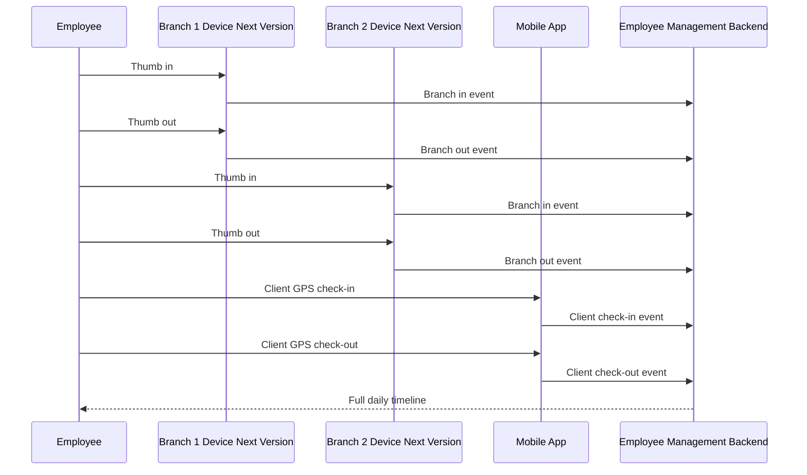
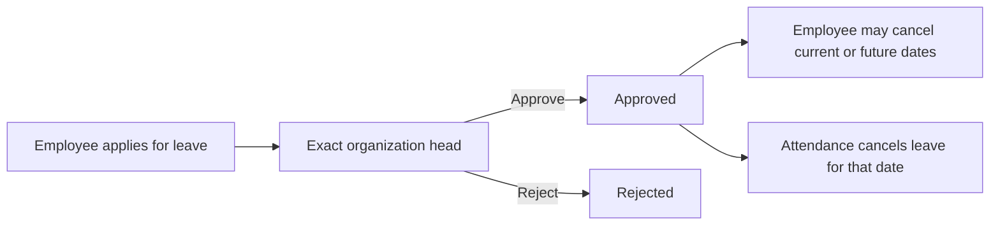

# Anytime Diesel Employee Management System User Guide

This guide explains how Developer Admin, HR, organization heads, employees, field staff, and leadership use the Anytime Diesel Employee Management System.

## Who Can Do What

| Area                           | Developer Admin                                                | Main Admin              | HR                      | CEO                   | Manager                     | Employee / Sales / Driver / Field Staff |
| ------------------------------ | -------------------------------------------------------------- | ----------------------- | ----------------------- | --------------------- | --------------------------- | --------------------------------------- |
| Dashboard                      | Full system view                                               | Admin view              | HR operations view      | Summary/report view   | Team view                   | Personal view                           |
| User logins                    | Create, edit, suspend, deactivate, reactivate, reset passwords | No                      | No                      | No                    | No                          | No                                      |
| Employees                      | Full access                                                    | Full access             | Full access             | Summary/report access | Assigned team only          | Own profile only                        |
| Departments                    | Add, edit, delete, assign department heads                     | As configured           | As configured           | View reports          | No                          | No                                      |
| Branches                       | Add, edit, deactivate                                          | Add, edit, deactivate   | Add, edit, deactivate   | View reports          | View assigned/team data     | No                                      |
| Biometric devices and mappings | Planned next version                                           | Planned next version    | Planned next version    | Planned next version  | Planned next version        | No                                      |
| Attendance                     | Full operational access                                        | Full operational access | Full operational access | Reports and summaries | Assigned team only          | Own attendance only                     |
| Leave policy and types         | Add, edit, delete                                              | Add, edit, delete       | Add, edit, delete       | View reports          | Approve assigned team leave | Apply and track own leave               |
| Holidays                       | Add, edit, delete                                              | Add, edit, delete       | Add, edit, delete       | View                  | View                        | View                                    |
| Audit logs                     | View                                                           | View                    | No                      | No                    | No                          | No                                      |
| Asset management               | Full access                                                    | No                      | Full access             | Read-only investment  | No                          | No                                      |
| Expenses and certificates      | Review all                                                     | Own requests            | Review all              | Own requests          | Own requests                | Own requests                            |
| System settings                | Full access                                                    | As configured           | No                      | No                    | No                          | No                                      |

## CEO Workspace

The CEO workspace is a read-only company overview. CEO accounts do not mark attendance and are
excluded from automatic absence settlement.

The dashboard shows:

- total workforce, employees present, employees on leave, pending leave decisions, attendance
  exceptions, and employees whose attendance is not settled;
- organization-wide task delivery totals for active, overdue, review, and completed work;
- the number of employees with assigned assets, monthly recurring investment, and estimated
  first-year investment;
- branch attendance coverage, detailed employee attendance, and upcoming birthdays; and
- a downloadable attendance summary.

Use the executive navigation shortcuts or sidebar:

- **Workforce** opens organization-wide employee information.
- **Attendance Overview** opens date, employee, branch, source, and movement details.
- **Work Progress** opens organization-wide tasks and daily progress.
- **Leave Overview** opens leave status and approval progress.
- **Company Investment** opens read-only physical and online asset investment by employee.

Employee Services, attendance marking, user provisioning, company setup, and system controls are
not shown in the CEO login.

## Responsive Navigation

- On phones, use the menu icon in the top-left corner. Selecting a page closes the menu.
- The mobile header shows the current page name and keeps search, notifications, and profile
  controls available.
- Page actions stack on narrow screens and move into a compact row when space is available.
- Wide operational tables scroll horizontally inside their own section instead of widening the
  complete page.
- The same permissions apply on mobile, tablet, laptop, and installed PWA displays.

## Login And First Password Change

1. Open the application URL.
2. Enter the email and temporary password issued by the Developer Admin.
3. If the account requires a first password change, enter a new password.
4. After changing the password, the application signs the user in automatically.

Public signup is disabled. All accounts are created by the Developer Admin.

## Developer Admin: Create A New Login

1. Open **User Logins**.
2. Select **Create Login**.
3. Choose the employee details, organization unit, branch, gender, and employment type.
4. Enter a temporary password for this account.
5. Save the login.
6. Share the login email and temporary password with the employee.

Notes:

- Leave and team workflows follow the organization-unit head hierarchy.
- Account creation and organization changes are recorded in audit logs.

## Developer Admin: Suspend, Deactivate, Or Reactivate A Login

Use **User Logins** for account lifecycle actions.

- **Suspend**: blocks login only for the selected date window. Attendance and employee history remain in the database.
- **Deactivate**: turns off the login until the Developer Admin reactivates it.
- **Blocked**: five consecutive incorrect passwords block login. Only the Developer Admin can reactivate it. Attendance history, biometric mappings, and task assignments are retained.

Employees receive account suspension notifications before the suspension date where the scheduled suspension notification feature is active.

## Developer Admin: Permanently Delete An Account

Use permanent deletion only when the employee and all related website data must be removed.

1. Open **User Logins**.
2. Select **Delete account** for the intended user.
3. Review the displayed list of profile, attendance, leave, biometric, asset, and task data that will be removed.
4. Type `DELETE` exactly.
5. Confirm permanent deletion.

The current signed-in account and Developer Admin accounts cannot be deleted. Use suspension, deactivation, or blocked-account reactivation when history must be retained.

## Developer Admin: Reset Testing Data Before Go-Live

Use **System Settings > Production Data Reset** only once the testing period is complete and immediately before entering real employee data.

1. Take and verify a MySQL backup.
2. Sign in with the Developer Admin account that must be preserved.
3. Open **System Settings** and select **Delete all testing data**.
4. Type `DELETE ALL TEST DATA` exactly and enter the current Developer Admin password.
5. Confirm the reset, then verify that User Logins contains only the preserved Developer Admin account.
6. Create the real organization logins from Developer Admin.

The reset preserves the signed-in Developer Admin account and password, branches, departments and their hierarchy, and system settings. It clears department-head assignments because the testing employees are removed. It permanently removes all other users, employees, attendance, leave types and requests, tasks, assets, holidays, biometric devices and mappings, announcements, subscriptions, service requests, notifications derived from those records, and audit history. The reset is transactional: a database failure rolls back the entire operation.

## Employee: Mark Attendance

Developer Admin assigns each employee a day or night shift and its start/end times while creating the account or from **Employees > Edit Employee**. For night shifts, punches after midnight and before the configured shift end remain part of the date on which the shift started. Mobile and biometric punches can be mixed within the same session.

Employees can use mobile attendance in the current version. Biometric/eSSL attendance is planned for the next version.

1. Open **My Attendance**.
2. Review today's timeline.
3. Use mobile check-in or check-out when allowed.
4. In the next version, biometric punches from eSSL/fingerprint devices will appear in the same daily timeline after they are imported or synced into the backend.

After a successful mobile punch, the status and timer update immediately while the live server timeline refreshes. Keep the page open if the network is slow; the punch button remains disabled while the request is pending to prevent duplicate submissions. Other signed-in devices update through the attendance live stream.

## Employee: Claim An Expense

1. Open **Employee Services** and select **Expenses**.
2. Select **New claim**.
3. Enter category, amount, expense date, description, and an optional shareable receipt link.
4. Submit. The request goes directly to HR.
5. Track Pending, Approved, Rejected, or Paid status and read the HR note on the same page.

HR reviews a pending claim first. A claim must be Approved before HR can mark it Paid. Payment processing itself remains an HR/accounting action outside the portal.

## Employee: Request A Certificate

1. Open **Employee Services** and select **Certificates**.
2. Select **New request**.
3. Choose certificate type, digital or printed delivery, optional required-by date, and explain the purpose.
4. Track Pending, In Progress, Ready, Rejected, or Collected status.
5. Open the document link when HR attaches a completed digital certificate.

Employees see only their own requests. HR and Developer Admin see the complete request queues.

Example movement timeline:

## Employee: Request Missed Punch Correction

An unmatched check-in remains active until the employee checks out. After nine hours, the employee receives one reminder that attendance is still running; the timer and session continue normally.

1. Open **Missed Punch Request**.
2. Select the date and punch time.
3. Select the missing event type.
4. Add a clear reason.
5. Submit.

Managers/HR can approve or reject corrections from **Attendance Corrections**.

## Employee: Apply For Leave

1. Open **Apply Leave**.
2. Select leave type.
3. Select from and to dates.
4. Enter the number of days and reason.
5. Submit.

The screen shows the current balance and full rules for Casual Leave, Sick Leave, Unpaid Leave / LOP, and Comp Off. Sick Leave accepts a shareable Google Drive report link. If it is not available when applying, add it from **Leave History** within three days after returning; the countdown is shown there.

Comp Off credits are valid only until December 31 of the year they are earned. Unused credits expire and cannot be requested in a later year.

### Request a weekly off

Weekly off is selected through this request flow, not while the account is created or edited.

1. Open **Apply Leave** and use **Request weekly off**.
2. Select a date at least one day in advance.
3. Submit it to the direct organization head.

Only one date is allowed in each Monday-Sunday week. It expires unused, does not carry forward, and cannot be consecutive with another weekly off, including Sunday followed by Monday.

The request is assigned to the nearest organization-unit head above the employee. Only that exact head can approve or reject it.

## Manager: Review Team Leave And Attendance

Organization heads see employees within their permitted unit hierarchy. Leave actions show only requests assigned directly to that head; a super-head cannot approve or reject a lower head's assigned request.

Use:

- **Attendance Overview** for team attendance.
- **Branch Attendance** for branch-wise activity.
- **Field Attendance** for GPS/client work.
- **Attendance Corrections** for missed punch requests.
- **Leave Approvals** for team leave.

## HR: Manage Leave Policies And Credits

1. Open **Leave Policies & Credits**.
2. Review the protected company policy cards.
3. Search for an employee and leave type.
4. Select the edit icon, enter the complete manual adjustment and reason, and save.

Policy types cannot be added, renamed, or deleted. Adjustments are recorded in Audit Logs. Payroll deductions for negative Casual Leave or Unpaid Leave / LOP remain a manual HR responsibility.

## HR/Admin: Manage Departments And Department Heads

1. Open **Departments**.
2. Add or edit a department.
3. Select the department head from active employees.
4. Save.

Department head assignment is stored on the department record and can be changed later by authorized admin users.

## HR/Admin: Manage Branches

1. Open **Branches**.
2. Add a new branch with code, name, city, address, latitude, longitude, attendance radius, and status.
3. Edit details when a branch changes.
4. Deactivate/delete only when the branch should no longer be used operationally.

## HR/Admin: Manage Biometric Devices And Mapping

Status: planned for the next version. The current application documents the intended eSSL/fingerprint mapping flow, but real device integration is not live yet.

1. Open **Biometric Devices**.
2. Add the eSSL device details, branch, IP, port, and location.
3. Open device mapping.
4. Link each employee to the biometric user ID from the device.

When eSSL integration is added in the next version, imported device punches should create attendance events for mapped employees.

## Holiday Management

1. Open **Holidays**.
2. Add the holiday name, date, classification, and branch scope.
3. Use **All branches** for a company-wide holiday or select one branch.
4. Edit or deactivate the entry when the calendar changes.

Every active entry visible in the Holiday list counts as a holiday for attendance. Public, Optional, and Restricted are classification labels only. At 10:00 AM IST a no-punch employee is marked Holiday; a later punch changes the day to Present. A completed holiday punch-in/out session automatically earns one Comp Off credit. Holiday changes recalculate existing summaries for the affected date and branch.

## Current And Future Attendance Verification

The next attendance improvements should make branch-mobile attendance stricter and easier to trust:

- GPS/location check near a configured branch is implemented and enforced by the backend.
- Approved branch Wi-Fi check, so attendance is accepted only when the mobile is connected to that branch network.
- Photo/selfie verification during check-in and check-out.
- Combined proof for branch-mobile attendance: location + Wi-Fi + optional photo.
- Clear status labels showing whether attendance was verified by branch GPS, Wi-Fi, biometric device, or HR correction.

## Notifications

Notifications are scoped to the signed-in user. Users should see only their own leave, birthday, system, suspension, and relevant workflow notifications.

Open app sessions receive new announcement updates immediately. Installed/background devices can display Web Push after the user grants notification permission. Browser or operating-system denial must be changed in device settings; the application cannot override it.

## HR/Developer Admin: Announcements

1. Open **Announcements**.
2. Select **New announcement**.
3. Enter a clear title, message, priority, and display-until date/time.
4. Publish. Open employee sessions refresh immediately and subscribed devices receive Web Push.
5. Use **Deactivate** to hide an announcement temporarily, or **Reactivate** to restore it.
6. Use **Permanently delete** only when the announcement must be removed. Type `DELETE` to confirm.

## Reports

Reports include filters for date range, employee, branch, department, source, status, client name, and field work type where supported.

In **Day Logs**, selecting **All Employees** shows a date-first hierarchy. Expand a date to
see its employees, then expand an employee to see every punch for that date. Selecting one
employee shows all available dates directly and removes the unnecessary branch filter.

The Day Logs Excel export applies the selected employee, date, and branch filters. Its first
sheet contains one summary row per employee. **Average Working Time Per Day** is calculated as
the employee's total worked time in the exported records divided by **Days Present**. Employees
with no present days show `00:00:00`. Each employee sheet retains the actual worked time for every
individual date. Holiday, Week Off, and Pending Attendance rows do not count as present unless
worked time was actually recorded.

Common report pages:

- Employee attendance report
- Branch-wise attendance report
- Multi-branch movement report
- Field attendance report
- Client visit report
- Leave report
- Payroll attendance summary

## HR And CEO: Review Company Investment Per Employee

Open **Asset Management** and review **Company investment per employee**. This section shows how
much Anytime Diesel currently invests in each employee through physical assets and online services
assigned to that person.

- **One-time invested:** purchase values recorded as one-time costs.
- **Monthly recurring:** monthly subscriptions plus yearly subscriptions normalized to a monthly amount.
- **Annual recurring:** monthly subscriptions multiplied by 12 plus yearly subscriptions.
- **First-year investment:** one-time invested plus annual recurring.

HR and Developer Admin can add, assign, edit, and return assets. CEO access is read-only. Shared
company-use assets such as tables and fans remain in company totals but are not attributed to an
individual employee.

## Mobile Use

The app is designed for phones, tablets, and laptops. See [DEVICE_COMPATIBILITY.md](DEVICE_COMPATIBILITY.md) for the iPhone, Pixel, Samsung, Vivo, Oppo, tablet, and desktop release checklist.

Recommended mobile workflows:

- Employees: My Attendance, Apply Leave, Leave History, Notifications, My Profile.
- Field staff: My Attendance with GPS check-in/check-out and client visit details.
- Managers: Leave Approvals and team attendance review.
