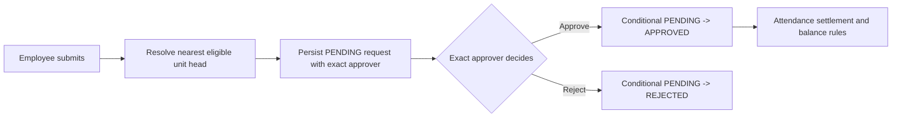

# Workflow and Security Audit

## Purpose and scope

This is the release acceptance record for the 25 July 2026 audit of account provisioning,
organization hierarchy, module access, leave, attendance, assets, expenses, HR Documents, session
security, database constraints, and frontend/backend permission alignment.

The audit followed each workflow from the screen, through the Express route and Zod validation, to
the Prisma transaction and MySQL constraints. It also reviewed the security checklist for broken
authorization, rate limits, secrets, JWT handling, input validation, database safety, failure
handling, logging, and dependency risk.

This document describes guarantees in the code. A production release is accepted only after the
database-backed commands in [Release verification](#release-verification) pass against the target
environment.

## End-to-end workflow map

### Single login creation


Only Developer Admin can call the creation route. Public signup is absent. The server, not the
spreadsheet or browser, derives the application role. Employee and account rows are created in one
transaction, private banking/statutory values are encrypted, and the employee change feed records
the canonical workforce change. Employee codes generated by the server use a timestamp plus random
suffix so concurrent requests and multiple backend instances cannot select the same sequential
code.

Dates are validated as a combined employment record: date of birth cannot be in the future and
joining date cannot be earlier than date of birth. The same rule applies to later profile changes.

### Bulk login creation

Bulk import uses the same `POST /users` transaction as single creation; it is not a second,
less-protected write path.

1. Developer Admin downloads a fresh workbook containing current companies, branches,
   organization units, and manager references.
2. The browser validates the complete workbook before enabling import and rejects duplicate email
   or employee-code values, invalid formats, invalid dates, unknown references, and unresolved
   manager dependencies.
3. Rows are ordered so a manager included in the workbook is created before direct reports.
4. Each row is sent to the normal backend creation route. The backend repeats authorization,
   validation, role derivation, encryption, uniqueness, and transaction checks.
5. Each row reports success or a specific failure. A failed row is not partially stored.

The operation is deliberately row-atomic, not workbook-atomic: successfully created employees
remain when a later row fails, and the result panel identifies rows to correct and retry. Sample
rows whose code or email still identifies them as examples are rejected so a downloaded template
cannot accidentally create demonstration employees. The workbook can contain plaintext temporary
passwords and sensitive employee details; delete it securely after import.

### Company, organization, manager, and branch model

The three legal employer choices are Royal Petro Park Private Limited, Anytime Diesel, and
Fuelistic Innovations Private Limited. Anytime Diesel and Fuelistic Innovations Private Limited
are presented under the Royal Petro Park Private Limited group. Legal employer is distinct from
attendance branch.

Organization units form the operational hierarchy used for visibility and approvals. The backend
prevents unit cycles, invalid heads, reporting-to-self, and indirect reporting-manager cycles such
as A -> B -> C -> A. Manager and head references must resolve to active eligible employees.

Branches are attendance locations with coordinates and a geofence radius. Reading branch labels is
a shared authenticated capability because dashboards, profiles, and attendance views require
them. Creating or changing branch configuration requires the Company module and an authorized
role.

Visibility is enforced when querying, not only when rendering:

| Actor                                   | Employee and operational visibility                   |
| --------------------------------------- | ----------------------------------------------------- |
| Developer Admin / authorized Main Admin | System-wide according to module access                |
| CEO                                     | Company-wide read-only executive views                |
| HR                                      | Company-wide HR operations according to module access |
| Organization head                       | Own organizational subtree                            |
| Employee                                | Own profile and own operational records               |

### Module access

Developer Admin controls role-to-module access from System Settings. Enforcement has two layers:

- the layout and sidebar hide disabled modules and direct navigation shows an access-disabled
  screen; and
- authenticated API middleware maps write/read routes to People, Company, Attendance, Leave,
  Assets, Work Planner, Communications, Profile, or System and rejects a disabled module.

The backend remains authoritative. Changing a role, suspension, deactivation, password, or module
configuration takes effect without trusting stale browser navigation.

### Leave and weekly-off approval



Only the approver stored on the request may action it. Review uses a conditional database update,
so two simultaneous approvals cannot both succeed. Leave balance checks and Comp Off credit
consumption occur in the same transaction as request creation. If attendance cancels an approved
Comp Off day, the consumed credit is released. Weekly-off and attendance-correction decisions use
the same stale-state protection.

Protected company leave types cannot be created, renamed, or deleted through the UI. HR can make
audited employee credit adjustments. Casual Leave accrual begins on the first day of the month
after joining.

### Attendance

An attendance event is the immutable input; the daily summary is derived. Employees may create
only their own mobile event. Manager, HR, CEO, and admin queries are restricted by role and
organizational scope.

When face verification is enabled, check-in requires an approved encrypted template, a
purpose-bound short-lived one-time challenge, liveness/anti-spoof checks, a matching face, and
fresh precise GPS. A rejected face or location never writes attendance and produces auditable
security metadata. Checkout requires the authenticated employee's active check-in and fresh GPS,
but intentionally does not require the camera. Developer Admin is exempt from face registration
and attendance.

Biometric administration endpoints are restricted to Developer Admin, Main Admin, and HR. Live
device synchronization remains a planned integration; no documentation should represent it as an
active device connector.

### Assets

Asset assignment status is derived from the effective assignee after an update:

- an asset with an employee is `ASSIGNED`;
- an asset without an employee cannot remain `ASSIGNED`; and
- an available/maintenance/retired asset has no employee assignment.

Create/update validates the referenced active employee. Return uses a transaction and a
conditional claim of the currently assigned asset. A concurrent reassignment or second return
receives HTTP 409 instead of creating contradictory history. Current state remains on
`company_assets`; completed return history remains in `asset_returns`.

### Expenses and HR Documents

Expense creation validates an active target employee. HR/Admin review uses conditional status
transitions to prevent double review. The supported expense states remain Pending, Unpaid, Paid,
and Rejected.

HR Documents is the professional interface name; the physical table and route retain
`certificate_requests` for migration compatibility. Printed delivery is stored as `PRINTED`.
The release migration converts legacy `PHYSICAL` rows and corrects the database check constraint.
Moving a digital document from Ready to Collected preserves its required document URL.

## Security checklist result

| Control                | Implemented assurance                                                                                                               |
| ---------------------- | ----------------------------------------------------------------------------------------------------------------------------------- |
| Authorization and IDOR | Central authenticated middleware, role checks, employee ownership/team scopes, board access policy, and API module enforcement      |
| Rate limiting          | General limiter and stricter authentication limiter; trusted proxy configuration is validated                                       |
| Secrets                | `.env`, keys, dumps, evidence, and generated data are ignored; repository audit and secret scan are release checks                  |
| JWT/session security   | Separate access/refresh secrets, HTTP-only secure cookies, expiry, and database-backed `session_version` revocation                 |
| Input validation       | Zod schemas, normalized identifiers, combined employment-date rules, hierarchy checks, and Prisma error mapping                     |
| Database permissions   | Application must use a dedicated least-privilege MySQL account in production; root is local bootstrap only                          |
| File handling          | Employee expense attachments are validated Google Drive URLs; encrypted face evidence is outside the web root and retention-limited |
| Dependency safety      | Lockfile-based `npm ci` and `npm run audit:deps`; unresolved advisories must be recorded before acceptance                          |
| Failure handling       | Validation/permission/conflict errors are explicit; Prisma reference/check failures do not expose SQL or credentials                |
| Logging/monitoring     | Audit logs for administrative/workflow actions; failed login logs store a one-way email hash rather than plaintext credentials; Main/Developer Admin may clear logs only with typed `CLEAR`, after which one `AUDIT_LOGS_CLEARED` event remains ([Audit Logs](AUDIT_LOGS.md)) |

Every authenticated request reloads the current account status and `session_version` from MySQL.
Suspension, deactivation, role-sensitive edits, password reset/change, and logout increment the
version, immediately invalidating previously issued cookies. This is global account-session
revocation, not per-device session management.

## Database changes in this audit

Migration `20260725110000_security_and_workflow_integrity`:

1. adds `users.session_version` with a non-null zero default;
2. converts legacy HR-document delivery value `PHYSICAL` to `PRINTED`; and
3. replaces the delivery-mode check constraint so the schema and application agree.

The read-only database audit now also verifies session versions, employee employment dates,
pending leave approver eligibility, hierarchy cycles, HR-document delivery/link state, and all
previous foreign-key and cross-table invariants.

## Automated coverage

`tests/workflowIntegrity.test.ts` protects the corrected rules: employment dates, signed session
versions, indirect manager cycles, derived asset assignment state, printed HR documents, and API
module mapping. The existing suite covers authentication, RBAC, hierarchy, leave policy,
attendance-day behavior, tasks, face attendance, private employee data, and integration DTOs.

Automated tests complement, but do not replace, the production role acceptance matrix below.

## Release verification

Run from the repository root:

```bash
npm ci
npx prisma validate
npm run repo:audit
npm run typecheck
npm run lint
npm test -- --run
npm run build
npm run build:backend
npm run audit:deps
```

With a disposable MySQL 8 database, apply every migration to an empty schema and run:

```bash
npm run db:deploy
npm run db:verify
npm run db:audit
```

Before production deployment, create and verify a non-empty backup. After deployment, repeat
`db:verify` and `db:audit`, then test:

1. one single login and a two-row manager/report bulk import;
2. Developer Admin, CEO, HR, organization head, and employee visibility;
3. module disabled/enabled behavior in both direct URLs and API calls;
4. leave submit/approve/cancel and an intentionally repeated review;
5. face-enabled check-in, wrong-face rejection, and GPS-only checkout;
6. asset assign/reassign/return and an intentionally repeated return;
7. expense review/payment and digital/printed HR Document completion; and
8. password reset or deactivation followed by rejection of an already-open session.

Credentials for this acceptance test belong in environment variables or a private test vault, not
Git.

## Operational limitations and ownership

- This repository audit cannot prove the contents of a production database without an authorized
  `DATABASE_URL`. A code-only pass must never be reported as a live-database pass.
- MySQL users, grants, backups, TLS, log retention, infrastructure monitoring, and alert routing
  are deployment-owner responsibilities.
- Server-Sent Event fan-out and some schedulers are designed for the documented single backend
  process. Introduce shared Redis locking/pub-sub before horizontally scaling backend workers.
- Self-hosted browser face matching reduces casual misuse but is not hardware-backed identity
  proofing. The documented privacy, consent, fallback, and manual review process remains required.
- Bulk import is row-atomic. Keep the result report until failed rows are corrected, then securely
  delete the workbook.
