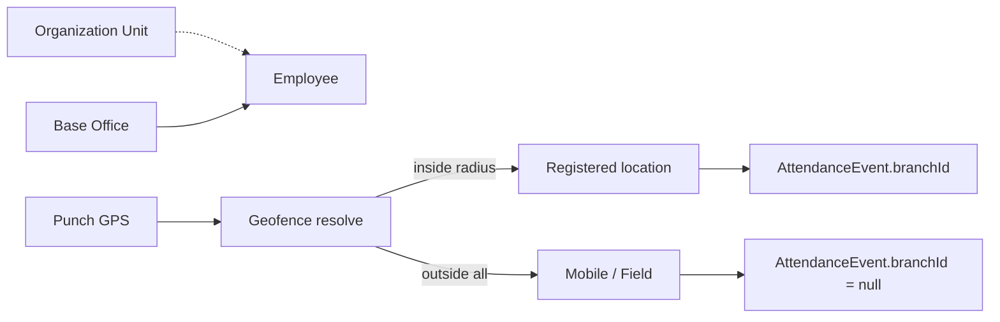
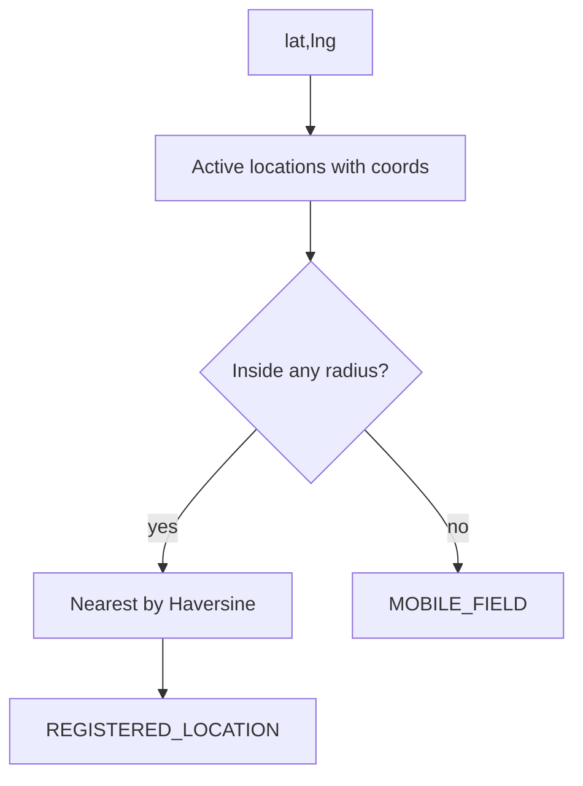

# Work Locations (Module 2)

## Organization vs Location

These concepts are separate and must stay separate:

| Concept | Meaning | Persisted as |
| --- | --- | --- |
| **Organization Unit** | Team / department graph (who reports where) | `Department` + org assignments |
| **Base Office** | Official default physical work location for an employee | `Employee.homeBranchId` + `EmployeeWorkLocationAssignment` |
| **Actual Attendance Location** | Where the employee physically punched | `AttendanceEvent.branchId` (or null = Mobile/Field) |

Example: employee belongs to Operations Department, Base Office = Madhapur Office, punches at Madhapur Hub-1 → attendance location is Hub-1; org unit and Base Office are unchanged.

A valid punch at Branch B is never rejected solely because Base Office is Branch A.

## Location types

UI labels ↔ canonical DB values:

| UI | DB |
| --- | --- |
| Office | `OFFICE` |
| Branch | `BRANCH` |
| Parking Hub | `PARKING_HUB` |
| Depot | `DEPOT` |
| Warehouse | `WAREHOUSE` |
| Other | `OTHER` |

`Branch.isHub` remains as a **compatibility mirror** of `PARKING_HUB` for Android 1.0.15. It is not the long-term canonical type.

Invalid free-text types are rejected server-side.

## Stable location codes

- Field: `branchCode` (API: `locationCode` / `code`)
- Uppercase snake case, unique, stable
- Suggested from name on create; editable before save
- Renaming the display name does **not** change the code

## Address model

Structured fields (not a single giant address only):

- `addressLine1` (required)
- `addressLine2` (optional)
- `locality` (Area / Locality)
- `city` (required)
- `state` — Indian state/UT **canonical code**, e.g. `TELANGANA` (UI: Telangana)
- `postalCode` — string, 6 digits for India (leading zeros preserved)
- `country` — default `India`

Legacy `address` is composed for backward-compatible display/DTO.

## Geofence / nearest match

Authoritative Haversine distance: `server/src/geofence.ts` → `distanceMeters`.

Resolution: `server/src/attendanceLocationResolve.ts` → `resolveAttendanceLocation`.

Rules:

1. Only **ACTIVE** locations with coordinates are candidates.
2. Base Office is **not** a filter.
3. If the point is inside multiple radii → **nearest** location wins.
4. If outside every radius → mode `MOBILE_FIELD`, `matchedLocation = null` (no invented Branch).
5. Radius: `attendanceRadiusMeters`, integer 25–5000. Existing production 250m values are preserved.

## Active / inactive

- Soft-deactivate → `status = INACTIVE` (legacy DELETE maps to deactivate)
- Inactive: hidden from new Base Office assignment and geofence matching
- History and FK references retained (no hard delete when referenced)

## Base Office history

Table: `employee_work_location_assignments`

- `assignmentType = BASE_OFFICE`
- `effectiveFrom` inclusive, `effectiveTo` exclusive
- One open primary Base Office at a time
- `Employee.homeBranchId` remains the compatibility snapshot

**Module 2 policy B:** future effective dates are rejected. Schema supports dates; scheduler for future snapshots is deferred.

Transfer:

1. Close open assignment (`effectiveTo = effectiveFrom`)
2. Open new assignment
3. Sync `homeBranchId`
4. Do **not** change Organization Unit or `User.role`

## Compatibility

| Legacy | Module 2 |
| --- | --- |
| `GET/POST/PATCH/DELETE /branches` | Still supported; create/update use work-location service |
| `branchCode`, `isHub`, `homeBranchId`, `AttendanceEvent.branchId` | Preserved |
| Additive APIs | `/work-locations`, deactivate/reactivate, base-office history/transfer, `/work-locations/match` |

Android published app (versionCode 16 / 1.0.15) must keep working against additive backend changes.

## Permissions

- Structure write (`POST/PATCH` `/work-locations`, deactivate/reactivate): **Developer Admin**
- Legacy `/branches` writes retain prior privileged roles for published clients
- Base Office transfer: Developer Admin / Main Admin / HR (existing employee-admin pattern)
- Organization Head does **not** gain Work Location configuration rights
- Location permission in UI is contextual — Work Locations page does not prompt GPS on load; only “Use current location” may request it

## APIs (additive)

- `GET /work-locations`
- `GET /work-locations/meta`
- `GET /work-locations/match?lat=&lng=`
- `GET /work-locations/:id`
- `POST /work-locations`
- `PATCH /work-locations/:id`
- `POST /work-locations/:id/deactivate`
- `POST /work-locations/:id/reactivate`
- `GET /employees/:id/base-office-history`
- `POST /employees/:id/base-office-transfer`

## Migration

Migration: `prisma/migrations/20260820180000_work_locations_foundation`

- Evolves `branches` in place (structured address, `location_type`, timezone, …)
- Backfills `location_type` from `is_hub` (`true` → `PARKING_HUB`, else `OFFICE`)
- Seeds open `BASE_OFFICE` assignments from `home_branch_id`
- Preserves branch IDs, employee home branches, attendance event branch IDs, radii, coordinates

**Do not run against production in Module 2 delivery.** Rehearse on disposable MySQL 8.0.x first.

## Future expansion

- Multi-timezone / multi-state India deployment
- Optional `regionId` / `parentLocationId` / metadata
- Attendance-policy approval for Mobile/Field (out of Module 2 scope)
- Scheduled future Base Office transfers (only if deterministic scheduler exists)
